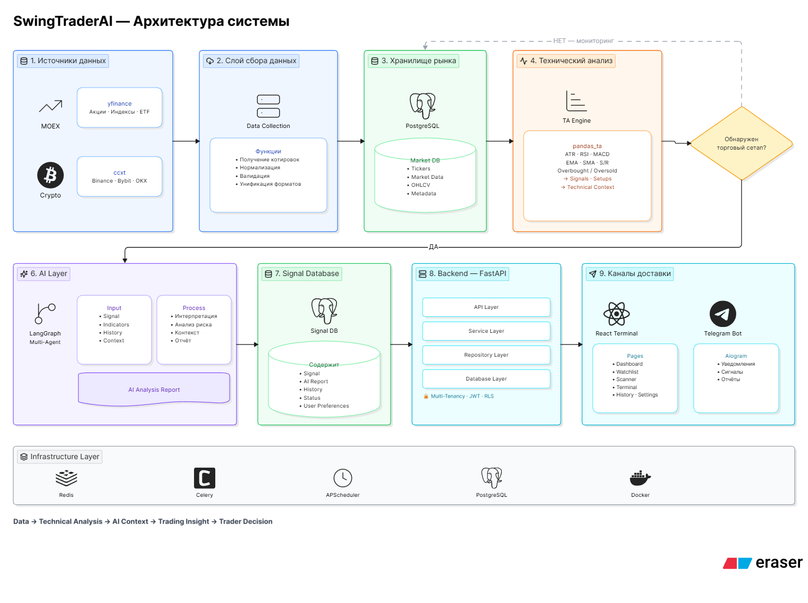
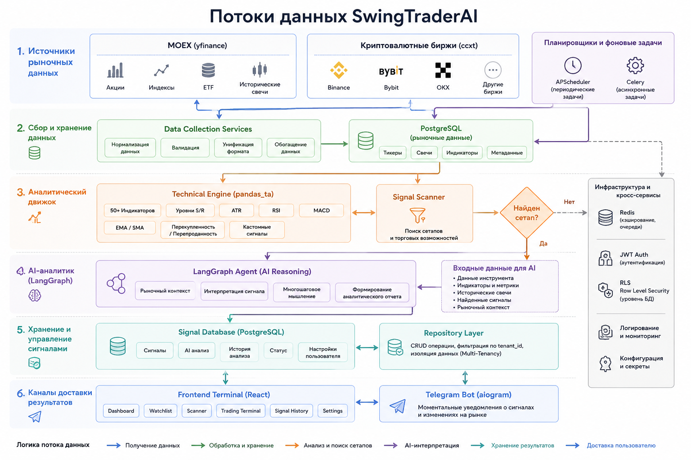

# Архитектура и взаимодействие компонентов

## Общая модель

SwingTraderAI построен как многоуровневая аналитическая платформа, объединяющая сбор рыночных данных, алгоритмический технический анализ, AI-интерпретацию сигналов и пользовательский терминал.

Каждый компонент системы отвечает за собственную область ответственности:

* Источники данных поставляют рыночную информацию.
* Аналитический движок рассчитывает технические показатели и торговые сигналы.
* AI-агенты интерпретируют рыночный контекст.
* Backend управляет бизнес-логикой и хранением данных.
* Frontend предоставляет интерфейс для анализа и принятия решений.
* Telegram Bot обеспечивает доставку уведомлений в реальном времени.

---

## Поток данных



---

## Слой рыночных данных

Система получает данные из нескольких источников:

### MOEX

Для российского рынка используются данные через yfinance:

* акции;
* индексы;
* ETF;
* исторические свечи.

### Криптовалютный рынок

Для криптовалют используются биржи через ccxt:

* Binance;
* Bybit;
* OKX;
* другие поддерживаемые площадки.

Все данные приводятся к единому формату и сохраняются в централизованное хранилище.

---

## Аналитический движок

После получения новых рыночных данных запускаются фоновые задачи APScheduler и Celery.

Движок рассчитывает:

* ATR;
* RSI;
* MACD;
* EMA;
* SMA;
* уровни поддержки и сопротивления;
* перекупленность и перепроданность;
* пользовательские торговые сигналы;
* более 50 технических индикаторов на базе pandas_ta.

Результатом работы становится структурированный технический анализ инструмента.

На данном этапе система использует исключительно алгоритмические методы и не задействует LLM.

---

## AI Layer

Когда технический движок обнаруживает потенциальный сетап, управление передается AI-агенту на базе LangGraph.

AI получает:

* данные инструмента;
* значения индикаторов;
* исторические свечи;
* найденные сигналы;
* текущий рыночный контекст.

После этого агент выполняет многошаговый анализ и формирует аналитическое заключение.

AI не рассчитывает индикаторы и не генерирует торговые сигналы самостоятельно.

Его задача заключается в интерпретации уже найденных закономерностей и объяснении рыночной ситуации.

Таким образом сохраняется разделение ответственности между математическим анализом и интеллектуальной интерпретацией.

---

## Backend Layer

Backend построен на FastAPI и использует многоуровневую архитектуру:


```text
API → Services → Repositories → Database
```

### API Layer

Обрабатывает HTTP-запросы, валидацию данных и аутентификацию.

### Services Layer

Содержит бизнес-логику:

* анализ рынка;
* запуск AI-агентов;
* управление сигналами;
* оркестрация процессов.

### Repository Layer

Изолирует работу с базой данных и предоставляет единый интерфейс доступа к данным.

### Database Layer

Хранит:

* пользователей;
* тикеры;
* рыночные данные;
* сигналы;
* историю анализа;
* настройки пользователей.

---

## Multi-Tenant Architecture

Система проектируется как SaaS-платформа с поддержкой нескольких независимых пользователей.

Каждый пользователь работает внутри собственного пространства данных.

Изоляция обеспечивается через:

* tenant_id;
* автоматическую фильтрацию запросов;
* JWT-аутентификацию;
* подготовленную инфраструктуру Row Level Security.

Общие рыночные данные используются всеми пользователями совместно, а персональные данные и настройки полностью изолированы.

---

## Frontend Layer

Frontend представляет собой аналитический терминал для свинг-трейдинга.


Основные разделы:

* Dashboard;
* Watchlist;
* Scanner;
* Trading Terminal;
* Signal History;
* User Settings.

Frontend построен по принципам Feature-Sliced Design и получает данные исключительно через REST API.

Для отображения графиков используется Lightweight Charts.

Для управления состоянием используются Zustand и TanStack Query.

---

## Система уведомлений

После генерации сигнала система может автоматически отправлять уведомления через Telegram.

Сообщение содержит:

* инструмент;
* направление сигнала;
* технические параметры;
* AI-комментарий;
* ссылку на полный анализ.

Это позволяет получать важные рыночные события без необходимости постоянно находиться в терминале.

---

## Архитектурный принцип



Основной принцип системы:

Данные → Анализ → Контекст → Решение

Система автоматически собирает информацию, находит торговые возможности и объясняет их значение, оставляя окончательное решение за трейдером.
