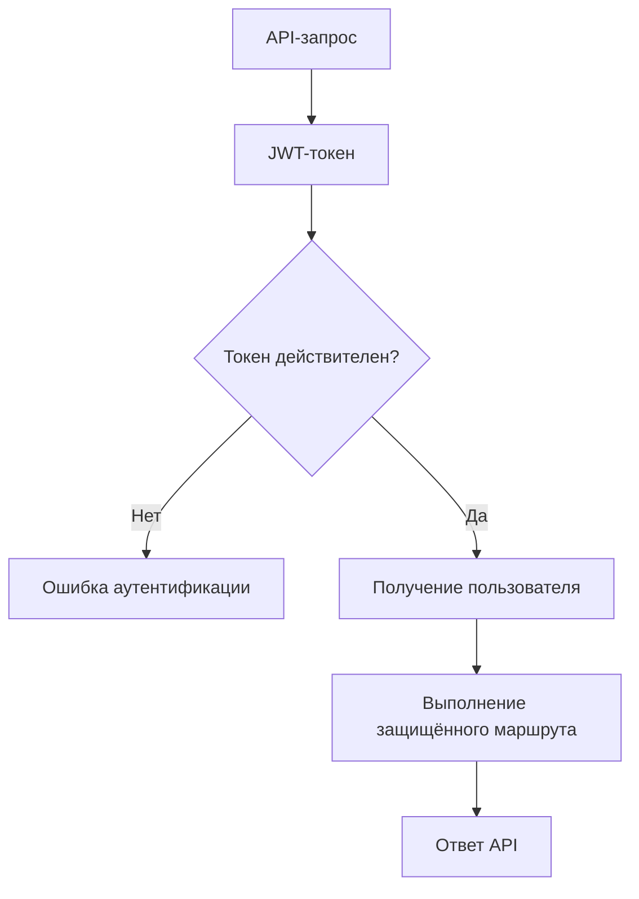
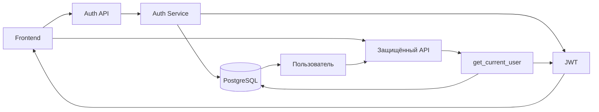

# Аутентификация

API использует аутентификацию на основе JWT. Основные компоненты, отвечающие за аутентификацию:

- `swingtraderai/core/security.py`
- `swingtraderai/api/deps.py`
- `swingtraderai/api/v1/auth.py`

## Процесс аутентификации

Процесс аутентификации состоит из следующих этапов:

1. Клиент отправляет учётные данные на `POST /api/v1/auth/login`.
2. Сервер проверяет данные пользователя и создаёт токен доступа.
3. Клиент передаёт полученный токен в HTTP-заголовке `Authorization: Bearer <access_token>`.
4. `get_current_user` проверяет токен и получает соответствующего пользователя из базы данных.
5. Защищённый API-метод выполняется только после успешной проверки пользователя.

```mermaid
sequenceDiagram
    participant Client as Клиент
    participant API as FastAPI
    participant Auth as Auth Service
    participant DB as PostgreSQL

    Client->>API: POST /api/v1/auth/login
    API->>Auth: Проверка учётных данных
    Auth->>DB: Поиск пользователя
    DB-->>Auth: Данные пользователя
    Auth-->>API: JWT access token
    API-->>Client: Токен доступа

    Client->>API: Запрос + Authorization: Bearer token
    API->>Auth: Проверка JWT
    Auth->>DB: Получение пользователя
    DB-->>Auth: Пользователь
    Auth-->>API: Аутентифицированный пользователь
    API-->>Client: Ответ
````

## Конфигурация токенов

Настройки JWT считываются из переменных окружения:

* `SECRET_KEY` — секретный ключ для подписи токенов;
* `ALGORITHM` — алгоритм подписи JWT;
* `ACCESS_TOKEN_EXPIRE_MINUTES` — время жизни токена доступа;
* `REFRESH_TOKEN_EXPIRE_DAYS` — время жизни токена обновления.

Эти параметры определены в:

```text
swingtraderai/core/config.py
```

Пример конфигурации:

```env
SECRET_KEY=replace-with-a-long-secret
ALGORITHM=HS256
ACCESS_TOKEN_EXPIRE_MINUTES=30
REFRESH_TOKEN_EXPIRE_DAYS=7
```

## Регистрация и вход

API предоставляет следующие маршруты для работы с учётной записью:

| Метод  | Endpoint                       | Назначение                        |
| ------ | ------------------------------ | --------------------------------- |
| `POST` | `/api/v1/auth/register`        | Регистрация нового пользователя   |
| `POST` | `/api/v1/auth/login`           | Вход в систему и получение токена |
| `POST` | `/api/v1/auth/logout`          | Выход из системы                  |
| `POST` | `/api/v1/auth/change-password` | Изменение пароля                  |

## Регистрация пользователя

При регистрации клиент передаёт необходимые данные пользователя на:

```text
POST /api/v1/auth/register
```

После успешной регистрации пользователь может выполнить вход через:

```text
POST /api/v1/auth/login
```

## Вход в систему

При входе сервер проверяет переданные учётные данные.

Если пользователь успешно проходит проверку, API возвращает JWT-токен доступа.

Полученный токен используется для последующих запросов к защищённым маршрутам:

```http
Authorization: Bearer <access_token>
```

Таким образом, клиенту не требуется повторно передавать логин и пароль при каждом API-запросе.

## Защищённые маршруты

Для доступа к защищённым endpoint используется зависимость `get_current_user`.

Упрощённая схема работы:



Если токен отсутствует, недействителен или просрочен, пользователь не получает доступ к защищённому маршруту.

## Хранение паролей

Пароли пользователей не должны храниться в базе данных в открытом виде.

Перед сохранением пароль проходит хеширование. Для проверки пароля при входе используется хеш, сохранённый в базе данных.

Таким образом:

```text
Пароль пользователя
        ↓
    Хеширование
        ↓
   Хеш в БД
        ↓
Проверка при входе
```

## Bearer-аутентификация

Проект использует `OAuth2PasswordBearer` для работы с Bearer-токенами.

Клиент передаёт токен в стандартном HTTP-заголовке:

```http
Authorization: Bearer <access_token>
```

FastAPI извлекает токен из заголовка, после чего зависимости приложения используют его для определения текущего пользователя.

## Токены доступа и обновления

В конфигурации проекта предусмотрены два связанных понятия:

* **Access Token** — токен доступа к защищённым API-методам;
* **Refresh Token** — токен, предназначенный для получения нового токена доступа после его истечения.

Для них предусмотрены отдельные настройки времени жизни:

```env
ACCESS_TOKEN_EXPIRE_MINUTES=30
REFRESH_TOKEN_EXPIRE_DAYS=7
```

При этом наличие настроек и вспомогательной логики для refresh-токенов не означает, что полный пользовательский сценарий обновления токена обязательно реализован во всех активных API-маршрутах. Конкретное поведение необходимо проверять по текущей реализации `auth.py` и связанных сервисов.

## Безопасность

Основные меры безопасности включают:

* хеширование пользовательских паролей;
* JWT-аутентификацию;
* проверку Bearer-токена;
* использование секретного ключа для подписи JWT;
* ограничение доступа к защищённым маршрутам через зависимости FastAPI;
* разделение настроек безопасности и исходного кода через переменные окружения.

Секретный ключ не следует хранить непосредственно в исходном коде или публиковать в репозитории.

## Общая архитектура

Аутентификация связывает frontend, API, сервисный слой и базу данных:



Таким образом, frontend получает токен после успешного входа и использует его для доступа к защищённым возможностям SwingTraderAI.

## Ссылки на исходный код

* [Утилиты безопасности](https://github.com/BulatNS31/SwingTraderAI/blob/main/swingtraderai/core/security.py)
* [Зависимости API](https://github.com/BulatNS31/SwingTraderAI/blob/main/swingtraderai/api/deps.py)
* [Маршруты аутентификации](https://github.com/BulatNS31/SwingTraderAI/blob/main/swingtraderai/api/v1/auth.py)
* [Конфигурация приложения](https://github.com/BulatNS31/SwingTraderAI/blob/main/swingtraderai/core/config.py)
