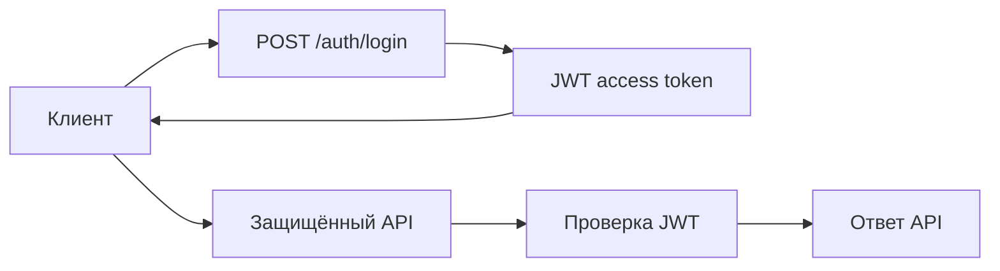
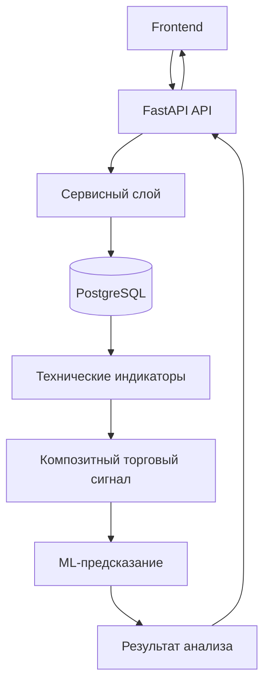
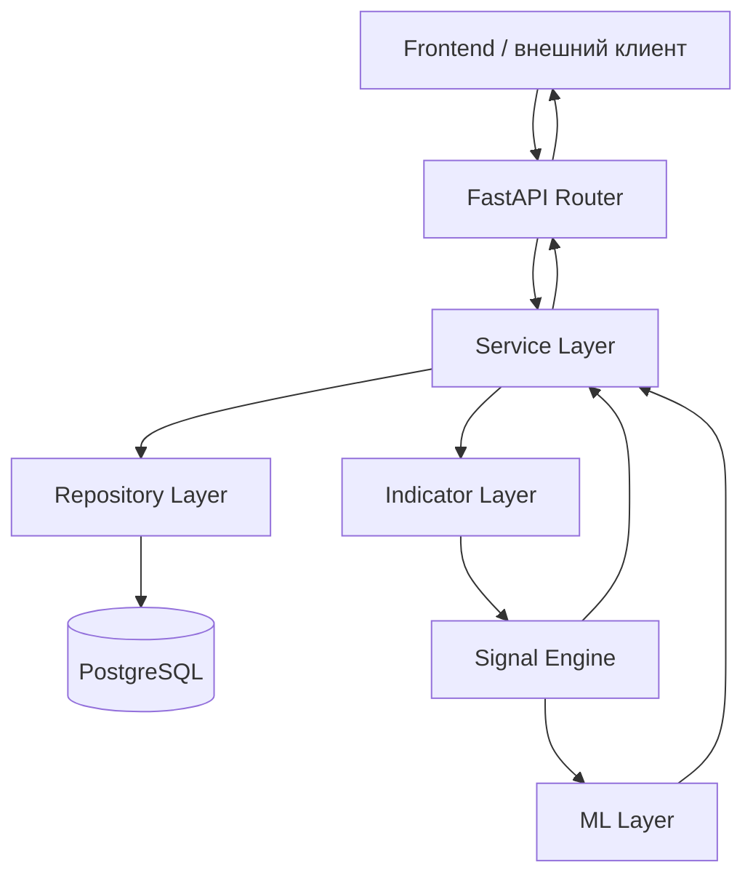

# Обзор API

Backend предоставляет HTTP API на базе `FastAPI`, основной экземпляр приложения находится в `swingtraderai/main.py`.

API отвечает за аутентификацию пользователей, работу с профилями, тикерами, избранными инструментами, рыночными данными, техническими индикаторами и торговыми сигналами.

## Группы маршрутов

| Префикс | Назначение | Файл |
| --- | --- | --- |
| `/api/v1/auth` | регистрация, вход, смена пароля, выход из системы | `swingtraderai/api/v1/auth.py` |
| `/api/v1/users` | профиль пользователя и операции с портфелем | `swingtraderai/api/v1/users.py` |
| `/api/v1/tickers` | создание и управление тикерами, поиск, исторические данные, получение сигналов | `swingtraderai/api/v1/tickers.py` |
| `/api/v1/watchlist` | добавление, удаление и просмотр инструментов в списке наблюдения | `swingtraderai/api/v1/watchlist.py` |
| `/api/v1/indicators` | получение доступных индикаторов и расчёт технических показателей | `swingtraderai/api/v1/indicators.py` |
| `/api/v1/markets` | рыночный обзор и маршруты для работы с рыночными данными | `swingtraderai/api/v1/markets.py` |
| `/api/v1/ml` | обучение ML-моделей и получение предсказаний | `swingtraderai/api/v1/admin/ml.py` |

## Основные API-методы

### Аутентификация

- `POST /api/v1/auth/register` — регистрация пользователя
- `POST /api/v1/auth/login` — вход в систему
- `POST /api/v1/auth/logout` — выход из системы
- `POST /api/v1/auth/change-password` — изменение пароля

### Пользователи

- `GET /api/v1/users/me` — получение информации о текущем пользователе
- `PATCH /api/v1/users/me` — обновление профиля текущего пользователя
- `GET /api/v1/users/{user_id}` — получение информации о пользователе

### Тикеры

- `POST /api/v1/tickers/` — создание тикера
- `GET /api/v1/tickers/` — получение списка тикеров
- `GET /api/v1/tickers/search` — поиск тикеров
- `GET /api/v1/tickers/{ticker_id}/data` — получение исторических рыночных данных
- `GET /api/v1/tickers/{ticker_id}/signals` — получение торговых сигналов

### Технические индикаторы

- `GET /api/v1/indicators/available` — получение списка доступных индикаторов
- `GET /api/v1/indicators/{ticker_id}` — расчёт индикаторов для выбранного тикера
- `GET /api/v1/indicators/{ticker_id}/signals` — получение сигналов на основе индикаторов

## Модель аутентификации

Проект использует JWT-аутентификацию.

Для работы с JWT используются:

- `OAuth2PasswordBearer`;
- `python-jose`;
- собственная логика безопасности проекта.

Основные компоненты аутентификации:

```text
swingtraderai/core/security.py
swingtraderai/api/deps.py
swingtraderai/api/services/auth_service.py
````

Для защищённых API-методов необходимо передавать JWT-токен в HTTP-заголовке:

```http
Authorization: Bearer <access_token>
```

Общий процесс выглядит следующим образом:



## Работа API с торговой аналитикой

API выступает связующим слоем между frontend-приложением и аналитической частью системы.

Типичный запрос на получение торгового сигнала проходит через следующие компоненты:



Таким образом, API не является самостоятельным торговым движком. Его задача заключается в предоставлении доступа к данным, аналитике и результатам работы backend-компонентов.

## Работа с торговыми сигналами

Сигналы могут формироваться на основе технических индикаторов и дополнительных аналитических компонентов.

API позволяет frontend-приложению получать результаты анализа по конкретному инструменту.

В зависимости от реализации сервиса результат может содержать:

* тикер или идентификатор инструмента;
* направление сигнала;
* итоговую оценку;
* силу сигнала;
* дополнительные параметры анализа;
* временную метку;
* объяснение или причину формирования сигнала.

Сигнальная система предназначена для поддержки принятия торговых решений, а не для непосредственного исполнения биржевых заявок.

## OpenAPI-документация

FastAPI автоматически предоставляет интерактивную документацию API.

Документация доступна по адресам:

```text
/docs
/redoc
```

Например, при локальном запуске backend API документация будет доступна через:

```text
http://localhost:8000/docs
```

Swagger UI позволяет просматривать доступные маршруты, параметры запросов, схемы данных и выполнять API-запросы непосредственно из браузера.

## Архитектура API

Общая структура API построена вокруг разделения ответственности:



Это позволяет отделить HTTP-интерфейс от бизнес-логики, доступа к базе данных и аналитических компонентов.

## Ссылки на исходный код

* [Основное приложение](https://github.com/BulatNS31/SwingTraderAI/blob/main/swingtraderai/main.py)
* [Роутер аутентификации](https://github.com/BulatNS31/SwingTraderAI/blob/main/swingtraderai/api/v1/auth.py)
* [Роутер тикеров](https://github.com/BulatNS31/SwingTraderAI/blob/main/swingtraderai/api/v1/tickers.py)
* [Сервис технических индикаторов](https://github.com/BulatNS31/SwingTraderAI/blob/main/swingtraderai/api/services/indicator_service.py)
