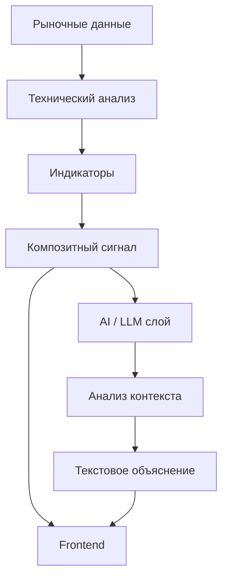
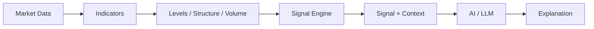
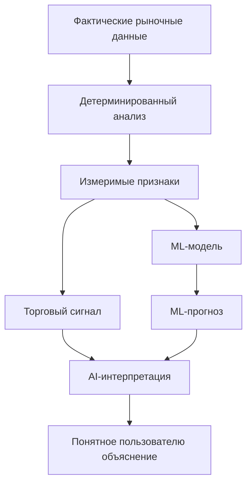
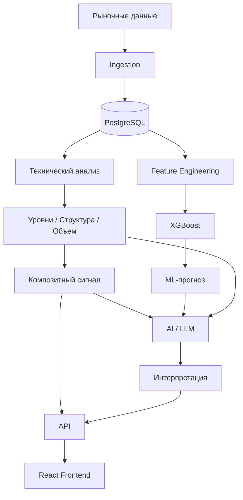

---

# AI-слой

**SwingTraderAI** предусматривает AI/LLM-компоненты как дополнительный уровень анализа и интерпретации результатов технического и количественного анализа.

При этом AI-слой необходимо четко отделять от основного детерминированного механизма формирования торговых сигналов.

Текущая архитектура проекта подтверждает наличие AI/LLM-зависимостей и соответствующего направления развития, однако не все AI-функции можно считать полностью реализованными runtime-компонентами.

## Роль AI в SwingTraderAI

Концептуально AI-слой предназначен для преобразования технических и количественных результатов в понятное человеку объяснение.

Упрощенная схема:



Таким образом, AI не должен заменять расчет индикаторов или детерминированную систему сигналов.

Его предполагаемая задача заключается в том, чтобы **объяснять уже полученный аналитический результат**, связывая отдельные признаки в единый рыночный контекст.

## Подтвержденные компоненты

В `pyproject.toml` присутствуют следующие AI/LLM-библиотеки:

```text
langchain
langgraph
```

Это подтверждает наличие соответствующей технологической базы и архитектурного направления проекта.

Однако наличие зависимости в `pyproject.toml` само по себе не означает, что библиотека активно используется в production runtime.

Поэтому документация разделяет **технологическую готовность** и **фактически работающую функциональность**.

## Предполагаемый pipeline AI-анализа

В рамках концепции SwingTraderAI AI-слой может работать поверх результатов детерминированного анализа:



На вход AI-слоя могут поступать структурированные результаты анализа, например:

\* направление движения; \* значения технических индикаторов; \* уровни поддержки и сопротивления; \* характеристики объема; \* сила сигнала; \* признаки торгового сценария; \* результат ML-модели.

На выходе предполагается получение человекочитаемой интерпретации.

## AI и торговая методология

AI-слой должен использоваться как средство **интерпретации торгового контекста**, а не как источник самостоятельной торговой стратегии.

Это особенно важно для концепции SwingTraderAI, основанной на формализации принципов активного и свингового трейдинга.

Основная логика должна оставаться структурированной:

```text
Рынок
  ↓
Цена и структура
  ↓
Уровни
  ↓
Объем
  ↓
Индикаторы
  ↓
Торговый сценарий
  ↓
Композитный сигнал
  ↓
ML-прогноз
  ↓
AI-интерпретация
```

Такое разделение позволяет избежать смешивания трех разных задач:

1. **Расчет фактов** — что происходит на рынке. 2. **Формирование сигнала** — какой торговый сценарий соответствует заданным правилам. 3. **Интерпретация** — как объяснить пользователю полученный результат.

## AI не заменяет технический анализ

Детерминированный аналитический слой остается основой системы.

Он отвечает за объективно вычисляемые значения:

\* индикаторы; \* уровни; \* характеристики цены; \* объем; \* сигналы; \* силу сигнала.

AI-слой работает поверх этих данных и может формировать их текстовую интерпретацию.

Это принципиальное архитектурное разделение:



## AI и ML выполняют разные задачи

В архитектуре SwingTraderAI важно не смешивать понятия **Machine Learning** и **AI/LLM**.

### ML

ML-компонент предназначен для работы с числовыми признаками и статистического прогнозирования.

Например:

```text
Рыночные данные
      ↓
Feature engineering
      ↓
XGBoost
      ↓
Prediction
```

### AI / LLM

LLM-компонент предназначен прежде всего для работы с контекстом и естественным языком:

```text
Индикаторы
      +
Сигналы
      +
Уровни
      +
ML-прогноз
      ↓
LLM
      ↓
Объяснение
```

Таким образом:

**ML отвечает на вопрос «что показывает модель?»**

**LLM отвечает на вопрос «как объяснить пользователю полученный результат?»**

Это разные уровни системы, и смешивать их в одну магическую коробку было бы архитектурно сомнительно.

## Текущее состояние реализации

AI-слой находится в состоянии частичной реализации / архитектурного направления.

Подтверждено:

\* наличие `langchain` в зависимостях; \* наличие `langgraph` в зависимостях; \* наличие ML-инфраструктуры; \* наличие детерминированного слоя технического анализа; \* концепция AI-интерпретации результатов.

При этом текущая кодовая база не позволяет однозначно утверждать, что полноценный LLM pipeline уже является обязательной частью runtime-процесса всех торговых сценариев.

Поэтому в документации AI-слой следует описывать как **предусмотренный архитектурой и развиваемый компонент**, а не как полностью автономный механизм принятия торговых решений.

## Архитектурные границы

AI-слой не должен:

\* самостоятельно получать неподтвержденные рыночные данные; \* подменять расчет технических индикаторов; \* изменять исходные аналитические значения; \* рассматриваться как гарантированный прогноз рынка; \* автоматически интерпретироваться как команда на совершение сделки.

Его задача заключается в предоставлении дополнительного контекста и объяснения.

Итоговая архитектурная модель:



## Исходный код

\* [Зависимости проекта](https://github.com/BulatNS31/SwingTraderAI/blob/main/pyproject.toml) \* [ML-компоненты](https://github.com/BulatNS31/SwingTraderAI/tree/main/swingtraderai/ml) \* [Сервис индикаторов](https://github.com/BulatNS31/SwingTraderAI/blob/main/swingtraderai/api/services/indicator_service.py)