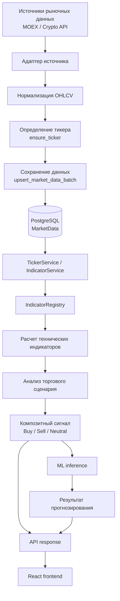
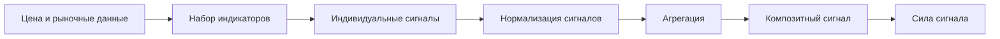
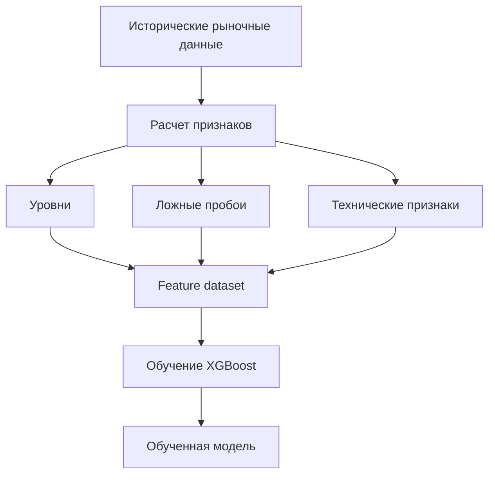
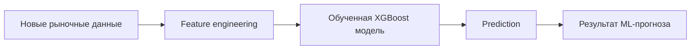
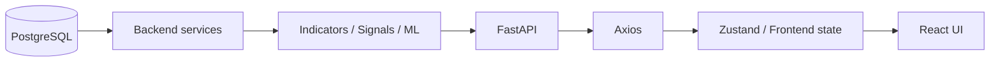
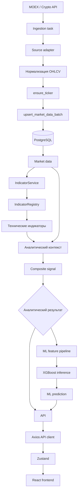

---

title: "Поток данных"
description: "Как рыночные данные проходят через SwingTraderAI: от источника до базы данных, аналитики, ML-модели и пользовательского интерфейса"
-------------------------------------------------------------------------------------------------------------------------------------------------

# Поток данных

В **SwingTraderAI** поток данных построен вокруг последовательной обработки рыночной информации:

**источник данных → загрузка → нормализация → PostgreSQL → технический анализ → торговый сигнал → ML-анализ → API → frontend**

При этом аналитическая и ML-части являются отдельными этапами. Это позволяет отличать детерминированный технический анализ от статистического прогноза модели.

## Общая схема



## 1. Источник рыночных данных

Первым этапом является получение рыночных данных от внешнего поставщика.

В текущем проекте предусмотрена работа с источниками, связанными с:

* **MOEX**;
* криптовалютными API;
* другими источниками через соответствующие адаптеры.

Основные компоненты ingestion находятся в:

```text
swingtraderai/ingestion/
swingtraderai/tasks/ingestion.py
```

Задача ingestion отвечает за организацию процесса загрузки данных, а конкретные адаптеры отвечают за взаимодействие с отдельными поставщиками.

## 2. Адаптер источника

Каждый источник предоставляет данные в собственном формате.

Адаптер преобразует ответ внешнего API в формат, который может использовать внутренний pipeline проекта.

Например, для MOEX соответствующая логика находится в:

```text
swingtraderai/ingestion/sources/moex.py
```

Основной тип данных для анализа представлен свечами **OHLCV**:

* `Open` — цена открытия;
* `High` — максимальная цена;
* `Low` — минимальная цена;
* `Close` — цена закрытия;
* `Volume` — объем.

## 3. Нормализация данных

После получения данных выполняется их приведение к единому внутреннему формату.

Это необходимо потому, что разные внешние источники могут использовать различные названия полей, форматы дат, типы данных и структуру ответа.

Канонический контракт рыночных данных определен в:

```text
swingtraderai/schemas/market_data.py
```

После нормализации данные становятся пригодными для сохранения и дальнейшего анализа независимо от первоначального источника.

## 4. Сохранение в PostgreSQL

После нормализации pipeline определяет соответствующий тикер и сохраняет рыночные данные в базе.

Основная логика находится в:

```text
swingtraderai/ingestion/saver.py
```

Используются операции:

```text
ensure_ticker
upsert_market_data_batch
```

Они позволяют:

1. определить или создать запись тикера;
2. сохранить полученные свечи;
3. обновить существующие записи при необходимости;
4. избежать дублирования рыночных данных.

Рыночные данные хранятся в модели:

```text
MarketData
```

Определение модели находится в:

```text
swingtraderai/db/models/market.py
```

Таким образом, PostgreSQL становится централизованным источником исторических данных для последующей аналитики.

## 5. Получение данных для анализа

После сохранения данные могут использоваться сервисным и аналитическим слоями.

В частности, с ними работают:

```text
TickerService
IndicatorService
```

`IndicatorService` является связующим компонентом между API и системой расчета индикаторов.

## 6. Расчет технических индикаторов

Регистрация доступных индикаторов централизована в:

```text
swingtraderai/indicators/registry.py
```

`IndicatorRegistry` предоставляет единый механизм поиска и использования зарегистрированных индикаторов.

Через:

```text
IndicatorService.get_indicators()
```

система получает запрошенные технические показатели и формирует результат типа:

```text
TechnicalIndicatorsOut
```

На этом этапе исходные рыночные данные преобразуются в набор вычисляемых аналитических признаков.

## 7. Анализ торгового сценария

Технические индикаторы не являются единственным источником информации.

Концепция SwingTraderAI предполагает совместное использование:

* ценового движения;
* рыночной структуры;
* уровней;
* объема;
* технических индикаторов;
* дополнительных признаков торгового сценария.

Это важно с точки зрения методологии проекта: система должна стремиться оценивать **контекст рынка**, а не просто реагировать на пересечение двух линий индикатора, потому что человечество уже достаточно пострадало от магических пересечений скользящих средних.

## 8. Формирование композитного сигнала

Метод:

```text
IndicatorService.get_signals()
```

оценивает зарегистрированные индикаторы и преобразует их результаты в унифицированные значения:

* `Buy`;
* `Sell`;
* `Neutral`.

После этого формируется композитный сигнал и его сила.

Упрощенно процесс можно представить так:



Это **детерминированный аналитический слой**.

Он не является LLM-системой, которая самостоятельно принимает торговые решения.

## 9. ML-анализ

ML-этап является отдельной частью pipeline.

Основные компоненты находятся в:

```text
swingtraderai/ml/trainer.py
swingtraderai/ml/inference.py
```

На этапе обучения формируется набор рыночных признаков.

В используемую систему признаков входят, в частности:

* характеристики уровней;
* признаки ложных пробоев;
* технические показатели;
* другие характеристики рыночного движения.

После подготовки признаков выполняется обучение классификатора **XGBoost**.

Упрощенная схема обучения:



При inference новые рыночные данные проходят через аналогичный процесс формирования признаков, после чего модель формирует прогноз.



## 10. API

Результаты анализа предоставляются frontend через FastAPI.

API может передавать:

* рассчитанные индикаторы;
* композитные сигналы;
* результаты ML-прогнозирования;
* рыночные данные;
* другие данные, доступные соответствующим API-маршрутам.

Таким образом, frontend не выполняет основную аналитическую работу самостоятельно. Он получает подготовленные backend результаты и отвечает преимущественно за их представление пользователю.

## 11. Frontend

Frontend расположен в:

```text
frontend/
```

Для взаимодействия с API используются **Axios** и **Zustand**.

Основной API-клиент находится в:

```text
frontend/src/shared/api/api-client.ts
```

Упрощенный путь данных до пользователя:



## Полный поток данных

С учетом всех основных компонентов общий pipeline можно представить следующим образом:



## Состояние реализации

| Этап                                    | Статус                                         |
| --------------------------------------- | ---------------------------------------------- |
| Получение рыночных данных               | Реализовано                                    |
| Адаптеры источников                     | Реализовано                                    |
| Нормализация данных                     | Реализовано                                    |
| Сохранение в PostgreSQL                 | Реализовано                                    |
| Расчет индикаторов                      | Реализовано                                    |
| Композитные сигналы                     | Реализовано                                    |
| ML-обучение                             | Реализовано                                    |
| ML-инференс                             | Реализовано                                    |
| LLM-слой объяснения                     | Не подтвержден как полноценная runtime-функция |
| Полная автоматизация уведомлений / бота | Частично реализована                           |

## Важное ограничение

Поток данных, описанный выше, не следует интерпретировать как полностью автоматизированный торговый контур.

Текущая система предназначена прежде всего для:

* получения рыночной информации;
* хранения исторических данных;
* технического анализа;
* формирования торговых сигналов;
* ML-прогнозирования;
* отображения результатов пользователю.

Она не является полноценной системой автоматического исполнения сделок через брокера.

## Data Flow Diagram - 1
<Image
  src="../source/data_flows.png"
  alt="Архитектура системы"
/>

## Data Flow Diagram - 2
<Image
  src="../source/diagram_flow.svg"
  alt="Архитектура системы"
/>

## Исходный код

* [Задача загрузки данных](https://github.com/BulatNS31/SwingTraderAI/blob/main/swingtraderai/tasks/ingestion.py)
* [Сохранение рыночных данных](https://github.com/BulatNS31/SwingTraderAI/blob/main/swingtraderai/ingestion/saver.py)
* [Адаптер MOEX](https://github.com/BulatNS31/SwingTraderAI/blob/main/swingtraderai/ingestion/sources/moex.py)
* [Реестр индикаторов](https://github.com/BulatNS31/SwingTraderAI/blob/main/swingtraderai/indicators/registry.py)
* [Сервис индикаторов](https://github.com/BulatNS31/SwingTraderAI/blob/main/swingtraderai/api/services/indicator_service.py)
* [ML trainer](https://github.com/BulatNS31/SwingTraderAI/blob/main/swingtraderai/ml/trainer.py)
* [ML inference](https://github.com/BulatNS31/SwingTraderAI/blob/main/swingtraderai/ml/inference.py)
* [API-клиент frontend](https://github.com/BulatNS31/SwingTraderAI/blob/main/frontend/src/shared/api/api-client.ts)
