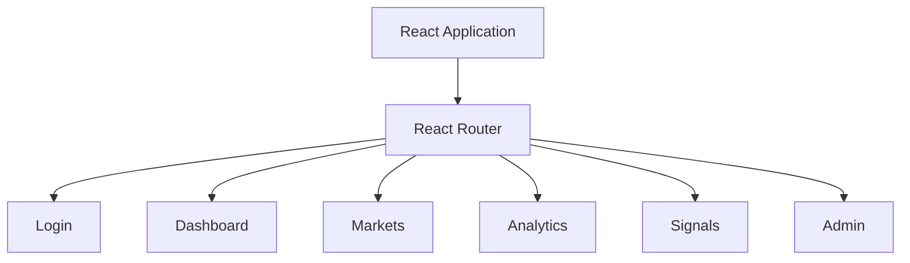
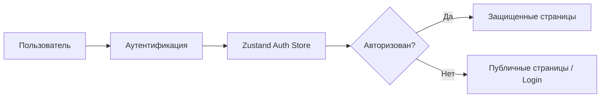
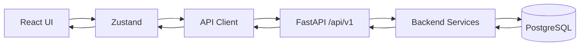
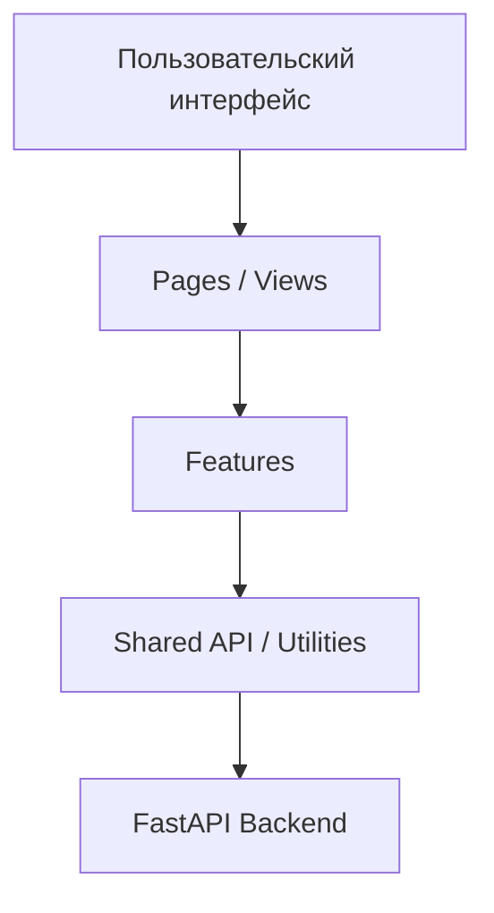

---

# Архитектура frontend

Frontend **SwingTraderAI** представляет собой отдельное приложение на базе **Vite \+ React \+ TypeScript**, расположенное в директории:

```text
frontend/
```

Frontend отвечает за пользовательский интерфейс системы, отображение рыночной информации, результатов технического анализа, торговых сигналов и взаимодействие пользователя с backend API.

## Структура

Основные директории frontend:

```text
frontend/src/
├── app/
├── features/
├── shared/
└── pages/
```

### `app/`

```text
frontend/src/app/
```

Содержит основную конфигурацию приложения:

\* инициализацию приложения; \* маршрутизацию; \* глобальную структуру frontend; \* конфигурацию основных компонентов приложения.

Центральная конфигурация маршрутов находится в:

```text
frontend/src/app/router.tsx
```

### `features/`

```text
frontend/src/features/
```

Содержит функциональные модули приложения, организованные по предметным областям.

В текущей структуре представлены компоненты, связанные с:

\* аутентификацией; \* watchlist; \* рынками; \* аналитикой; \* административными функциями; \* другими пользовательскими возможностями.

Такое разделение позволяет изолировать логику отдельных функций и не превращать frontend в один гигантский файл, который через пару месяцев начинает напоминать археологический слой.

### `shared/`

```text
frontend/src/shared/
```

Содержит общие компоненты и инфраструктурную логику, используемую несколькими функциональными модулями.

В частности:

\* API-клиент; \* общие утилиты; \* переиспользуемую UI-логику; \* общие frontend-компоненты.

Основной API-клиент находится в:

```text
frontend/src/shared/api/api-client.ts
```

### `pages/`

```text
frontend/src/pages/
```

Содержит страницы приложения и route-level компоненты.

Именно эти компоненты связывают конкретный URL приложения с соответствующим пользовательским экраном.

## Маршрутизация

Основная карта маршрутов определяется в:

```text
frontend/src/app/router.tsx
```

Она включает маршруты для различных разделов приложения, в том числе:

\* страницы входа; \* dashboard; \* рынков; \* аналитики; \* торговых сигналов; \* административных экранов.

Упрощенная схема навигации:



## Управление состоянием

Для управления состоянием на стороне клиента используется **Zustand**.

Одним из основных store является:

```text
frontend/src/features/auth/store/auth-store.ts
```

Он отвечает за состояние аутентификации пользователя и сохранение соответствующей информации на frontend.

В зависимости от состояния аутентификации frontend определяет доступ пользователя к защищенным разделам приложения.

Упрощенно:



## Аутентификация

Frontend хранит состояние авторизации и использует его для управления навигацией пользователя.

Основная логика состояния аутентификации находится в:

```text
frontend/src/features/auth/store/auth-store.ts
```

При взаимодействии с backend frontend передает необходимые данные через централизованный API-клиент.

## Взаимодействие с backend

Frontend взаимодействует с backend через централизованный API-клиент:

```text
frontend/src/shared/api/api-client.ts
```

Backend предоставляет REST API на базе **FastAPI**.

Основной namespace API:

```text
/api/v1/*
```

Общий поток взаимодействия:



Таким образом, frontend не взаимодействует с базой данных напрямую. Все основные операции с backend-данными проходят через API.

## Frontend и аналитическая система

Frontend является пользовательским уровнем SwingTraderAI и не выполняет основную серверную аналитику самостоятельно.

Получение и обработка рыночных данных происходит на backend:

```text
Рыночные данные
      ↓
Backend
      ↓
Индикаторы
      ↓
Торговые сигналы
      ↓
ML-анализ
      ↓
FastAPI
      ↓
Frontend
```

Frontend отвечает за отображение этих результатов и взаимодействие пользователя с системой.

Это особенно важно для концепции SwingTraderAI: вычислительная и аналитическая логика отделена от интерфейса, поэтому торговые алгоритмы можно развивать независимо от визуальной части приложения.

## Основные пользовательские сценарии

С точки зрения архитектуры frontend поддерживает несколько основных направлений взаимодействия:

### Аутентификация

```text
Login
  ↓
FastAPI
  ↓
Auth Store
  ↓
Авторизованное приложение
```

### Работа с рынком

```text
Markets
  ↓
API
  ↓
Рыночные данные
  ↓
React UI
```

### Аналитика

```text
Analytics
  ↓
API
  ↓
Индикаторы / сигналы / ML
  ↓
React UI
```

### Администрирование

```text
Admin
  ↓
API
  ↓
Admin endpoints
  ↓
Admin UI
```

## Архитектурная модель

В упрощенном виде frontend можно представить как четыре уровня:



Где:

\* **UI** отвечает за отображение; \* **Pages** формируют страницы приложения; \* **Features** содержат предметную логику отдельных функций; \* **Shared** предоставляет общие инструменты; \* **FastAPI Backend** является источником данных и серверной бизнес-логики.

## Технологический стек

Основные технологии frontend:

| Компонент | Технология |
| --- | --- |
| UI framework | React |
| Язык | TypeScript |
| Сборщик | Vite |
| Управление состоянием | Zustand |
| HTTP API | Axios |
| Backend API | FastAPI |
| API protocol | REST |

## Состояние реализации

Frontend уже представляет собой полноценный пользовательский каркас приложения с реальными страницами, маршрутизацией, состоянием аутентификации и интеграцией с backend API.

При этом документация не утверждает, что **каждый существующий маршрут или функциональный модуль полностью завершен**.

Подтвержденными архитектурными характеристиками являются:

\* React \+ TypeScript; \* Vite; \* структура `app / features / shared / pages`; \* централизованная маршрутизация; \* Zustand для клиентского состояния; \* централизованный API-клиент; \* REST-взаимодействие с FastAPI backend.

## Frontend


## Исходный код

\* [Frontend router](https://github.com/BulatNS31/SwingTraderAI/blob/main/frontend/src/app/router.tsx) \* [Инициализация приложения](https://github.com/BulatNS31/SwingTraderAI/blob/main/frontend/src/App.tsx) \* [Auth store](https://github.com/BulatNS31/SwingTraderAI/blob/main/frontend/src/features/auth/store/auth-store.ts) \* [API-клиент](https://github.com/BulatNS31/SwingTraderAI/blob/main/frontend/src/shared/api/api-client.ts)