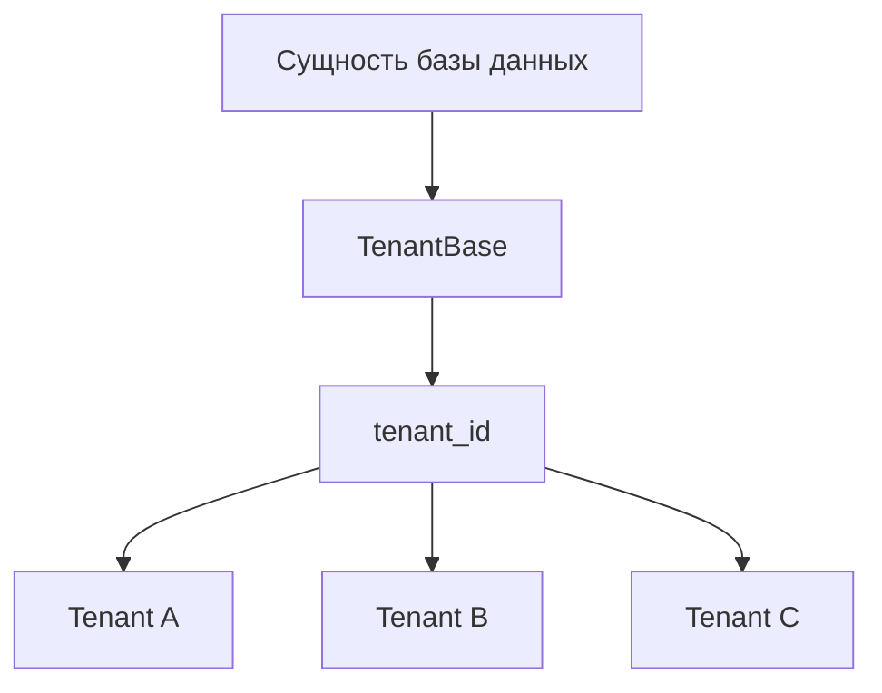
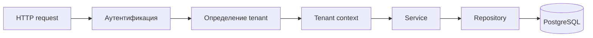
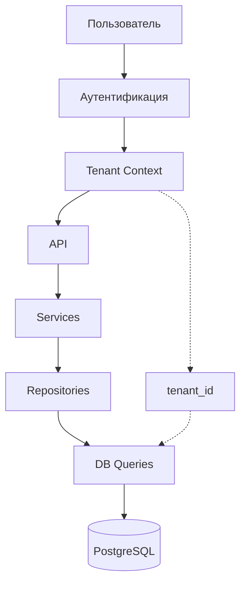

---

# Мультитенантность

**SwingTraderAI** содержит архитектурные абстракции для поддержки мультитенантной модели, однако на текущем этапе их следует рассматривать как **частично реализованную инфраструктуру**, а не как полностью завершенную и гарантированно применяемую runtime-функцию.

Концепция мультитенантности предусматривает возможность разделения данных и ресурсов между различными tenant-контекстами.

## Что реализовано

В кодовой базе присутствуют компоненты, связанные с мультитенантностью:

\* `TenantBase` в `swingtraderai/db/base.py`; \* tenant-ориентированная логика в `swingtraderai/core/tenant.py`; \* ссылки на tenant-scoped подходы к работе с данными в моделях и repository-слое; \* tenant-поля, включая `tenant_id`, в соответствующих моделях данных.

Это показывает, что архитектура проекта изначально проектировалась с учетом возможности разделения данных между tenant-контекстами.

## Что означает tenant

В контексте SwingTraderAI **tenant** представляет отдельный логический контекст данных приложения.

Концептуально:

```text
Tenant A
├── Пользователи
├── Watchlist
├── Портфели
├── Сигналы
└── Другие данные

Tenant B
├── Пользователи
├── Watchlist
├── Портфели
├── Сигналы
└── Другие данные
```

Цель такой архитектуры заключается в том, чтобы данные одного tenant не смешивались с данными другого.

## TenantBase

Базовая tenant-абстракция находится в:

```text
swingtraderai/db/base.py
```

Компонент:

```text
TenantBase
```

используется как основа для tenant-aware моделей.

Это позволяет на уровне модели выразить принадлежность записи определенному tenant-контексту.

Упрощенная схема:



## Tenant-контекст

Дополнительная логика работы с текущим tenant находится в:

```text
swingtraderai/core/tenant.py
```

Этот слой предназначен для определения и работы с tenant-контекстом приложения.

Концептуальный поток выглядит следующим образом:



При полноценной реализации tenant-контекст должен сохраняться на всем пути от входящего запроса до обращения к базе данных.

## Repository-слой

В repository-слое присутствуют паттерны, связанные с tenant-scoped доступом к данным:

```text
swingtraderai/api/repositories/
```

В идеальной реализации каждый запрос к tenant-aware сущности должен учитывать текущий tenant.

Например:

```text
Запрос пользователя
       ↓
Tenant A
       ↓
Repository
       ↓
WHERE tenant_id = A
       ↓
PostgreSQL
```

Это предотвращает получение данных, принадлежащих другому tenant.

## Что пока не подтверждено

Несмотря на наличие tenant-абстракций, текущая кодовая база не дает достаточных оснований утверждать, что **изоляция tenant полностью и последовательно обеспечивается во всех runtime-путях**.

В частности, в рамках текущего анализа не подтверждена централизованная гарантия tenant-scoping для каждого:

\* API endpoint; \* repository; \* database query; \* service; \* фоновой задачи; \* административного сценария.

Поэтому наличие `tenant_id` в модели само по себе нельзя считать доказательством полной изоляции данных.

## Уровни мультитенантности

Для полноценной мультитенантной архитектуры необходимо контролировать несколько уровней:



Каждый уровень должен сохранять информацию о tenant и не позволять запросу выйти за пределы разрешенного tenant-контекста.

## Изоляция на уровне базы данных

Для production-grade мультитенантной системы может использоваться дополнительный уровень защиты непосредственно в PostgreSQL.

Например:

```text
Application-level filtering
        +
Database-level isolation
        ↓
Tenant data isolation
```

В качестве такого механизма может применяться **Row-Level Security (RLS)** или эквивалентная политика ограничения доступа.

Однако в текущей документации RLS не следует указывать как реализованную функцию, если соответствующая конфигурация базы данных явно не подтверждена в репозитории.

## Текущее состояние

| Компонент | Состояние |
| --- | --- |
| Tenant-абстракция | Реализована |
| `TenantBase` | Реализован |
| `tenant_id` в моделях | Присутствует |
| Tenant utility logic | Присутствует |
| Tenant-aware repositories | Частично |
| Централизованная tenant-изоляция API | Не подтверждена полностью |
| Изоляция всех DB queries | Не подтверждена |
| PostgreSQL Row-Level Security | Не подтверждена |
| Полностью изолированная production multi-tenancy | Не подтверждена |

## Практическая позиция

Корректно описывать мультитенантность SwingTraderAI следующим образом:

\> **SwingTraderAI спроектирован с учетом мультитенантной модели и содержит соответствующие абстракции на уровне моделей, tenant-контекста и доступа к данным. При этом полная сквозная изоляция tenant на уровне всех API-маршрутов, запросов к базе данных и runtime-сценариев на текущем этапе не подтверждена.**

Это означает, что мультитенантность является **частью архитектурного направления проекта**, но не должна позиционироваться как полностью завершенная production-функция без дополнительной валидации.

## Рекомендации для дальнейшего развития

Для полноценной реализации мультитенантной архитектуры необходимо обеспечить:

1. централизованное определение текущего tenant; 2. обязательную передачу tenant-контекста в сервисный слой; 3. автоматическое применение `tenant_id` в tenant-aware repositories; 4. защиту от запросов с чужим `tenant_id`; 5. тесты на межtenant-изоляцию; 6. проверку фоновых Celery-задач; 7. отдельную проверку административных endpoints; 8. при необходимости, дополнительную защиту на уровне PostgreSQL через RLS.

Особенно важны автоматизированные тесты, проверяющие сценарий:

```text
Пользователь Tenant A
        ↓
Попытка получить данные Tenant B
        ↓
Доступ запрещен
```

Именно такой тест лучше любого красивого поля `tenant_id` показывает, действительно ли мультитенантность работает, а не просто хорошо выглядит в модели данных.

## Исходный код

\* [DB Base](https://github.com/BulatNS31/SwingTraderAI/blob/main/swingtraderai/db/base.py) \* [Tenant Core](https://github.com/BulatNS31/SwingTraderAI/blob/main/swingtraderai/core/tenant.py) \* [Repositories](https://github.com/BulatNS31/SwingTraderAI/tree/main/swingtraderai/api/repositories)