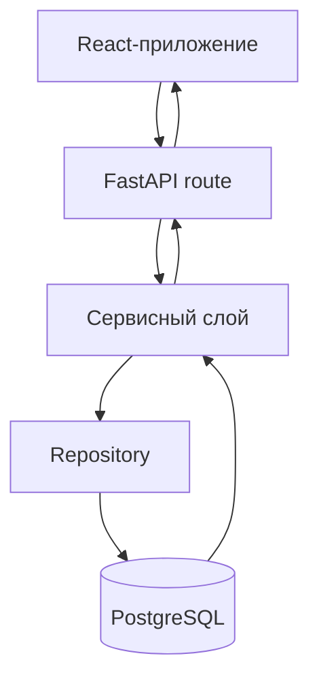

---

title: "Обзор архитектуры"
description: "Архитектура репозитория: backend, база данных, аналитический слой и frontend"
-------------------------------------------------------------------------------------------

# Обзор архитектуры

Репозиторий построен на многослойной архитектуре backend с отдельным frontend-приложением.

В основе **SwingTraderAI** находится система сбора, хранения и анализа рыночных данных, а не исключительно механизм исполнения торговых операций.

Архитектура разделяет получение данных, бизнес-логику, технический анализ, машинное обучение и предоставление результатов пользователю.

## Основные слои

* **Frontend** — приложение на Vite + React + TypeScript, расположенное в `frontend/src/`.
* **Backend** — FastAPI-приложение в `swingtraderai/main.py`.
* **API-слой** — маршруты API в `swingtraderai/api/v1/`.
* **Сервисный слой** — бизнес-логика и orchestration в `swingtraderai/api/services/`.
* **Слой репозиториев** — доступ к базе данных в `swingtraderai/api/repositories/`.
* **Слой данных** — SQLAlchemy-модели в `swingtraderai/db/models/` и асинхронная сессия в `swingtraderai/db/session.py`.
* **Аналитический слой** — расчет индикаторов, формирование признаков, обучение и инференс ML-моделей в `swingtraderai/indicators/` и `swingtraderai/ml/`.
* **Worker-слой** — фоновые задачи Celery в `swingtraderai/tasks/`, использующие Redis в качестве брокера и backend.

## Ответственность компонентов

| Слой         | Ответственность                                                            | Файлы                                 |
| ------------ | -------------------------------------------------------------------------- | ------------------------------------- |
| API          | Аутентификация, CRUD для тикеров, индикаторы, watchlist, рыночный snapshot | `swingtraderai/api/v1/*.py`           |
| Services     | Бизнес-логика и координация работы с данными                               | `swingtraderai/api/services/*.py`     |
| Repositories | Доступ к данным и выполнение запросов                                      | `swingtraderai/api/repositories/*.py` |
| Database     | Схема базы данных, связи между сущностями, tenant-поля                     | `swingtraderai/db/models/*.py`        |
| Indicators   | Определение метрик, расчет индикаторов и извлечение сигналов               | `swingtraderai/indicators/*.py`       |
| ML           | Обучение моделей и получение прогнозов                                     | `swingtraderai/ml/*.py`               |
| Tasks        | Загрузка рыночных данных и выполнение фоновых задач                        | `swingtraderai/tasks/*.py`            |

## Аналитическая архитектура

С точки зрения торговой методологии архитектура проекта может быть представлена как последовательность обработки рыночной информации:

```text
Рыночные данные
       ↓
Предобработка
       ↓
Технические индикаторы
       ↓
Анализ цены и структуры
       ↓
Уровни и объем
       ↓
Формирование признаков
       ↓
Агрегация сигналов
       ↓
ML-анализ
       ↓
Итоговый результат
       ↓
API / Frontend
```

Такое разделение позволяет постепенно расширять аналитическую систему и добавлять новые правила, признаки и модели, не связывая их напрямую с пользовательским интерфейсом.

С методологической точки зрения эта архитектура соответствует цели SwingTraderAI: **формализовать процесс анализа рынка и приблизить его к воспроизводимому алгоритмическому торговому процессу**.

При этом наличие отдельного ML-слоя не означает, что все торговые решения принимаются машинным обучением. Классический технический анализ, ценовая структура, уровни и объем остаются самостоятельными источниками аналитических признаков.

## Взаимодействие компонентов

Типичный запрос к системе проходит через несколько уровней:



В упрощенном виде последовательность выглядит так:

1. Пользователь взаимодействует с frontend.
2. Frontend отправляет запрос в FastAPI API.
3. API-маршрут передает запрос в сервисный слой.
4. Сервис выполняет необходимую бизнес-логику.
5. Repository обращается к PostgreSQL.
6. Результат возвращается через сервисный слой.
7. FastAPI формирует API-ответ.
8. Frontend отображает результат пользователю.

Для аналитических операций этот процесс может дополняться расчетом индикаторов, обработкой рыночных данных и обращением к ML-моделям.

## Слой API

API является точкой взаимодействия между frontend и backend.

Маршруты находятся в:

```text
swingtraderai/api/v1/
```

Существующая реализация включает API для таких задач, как:

* аутентификация;
* работа с тикерами;
* получение индикаторов;
* управление watchlist;
* получение рыночного snapshot;
* работа с другими backend-сервисами.

FastAPI также предоставляет автоматически генерируемую OpenAPI-документацию.

## Сервисный слой

Сервисный слой находится в:

```text
swingtraderai/api/services/
```

Его назначение заключается в размещении бизнес-логики и координации операций между API, репозиториями и другими компонентами системы.

Это позволяет не помещать всю бизнес-логику непосредственно в API-маршруты.

## Repository-слой

Repository-слой отвечает за взаимодействие с базой данных:

```text
swingtraderai/api/repositories/
```

Он инкапсулирует запросы и операции доступа к данным, предоставляя сервисному слою более высокий уровень абстракции.

## Слой базы данных

Модели базы данных находятся в:

```text
swingtraderai/db/models/
```

Для работы с PostgreSQL используется SQLAlchemy с асинхронной сессией.

Сессия базы данных определяется в:

```text
swingtraderai/db/session.py
```

Модели содержат связи между сущностями и поддерживают tenant-поля, включая `tenant_id`.

## Аналитический слой

Аналитическая часть проекта разделена между:

```text
swingtraderai/indicators/
swingtraderai/ml/
```

### Indicators

Слой индикаторов отвечает за расчет технических метрик и получение аналитических сигналов.

Он является одним из основных компонентов формализации рыночного анализа.

В дальнейшем этот слой может расширяться за счет новых правил анализа:

* ценовой структуры;
* уровней поддержки и сопротивления;
* объема;
* импульса;
* трендовых характеристик;
* других признаков, используемых торговыми стратегиями.

### ML

ML-слой отвечает за:

* подготовку признаков;
* обучение моделей;
* сохранение обученных моделей;
* выполнение прогнозов.

В проекте используются библиотеки машинного обучения, включая `scikit-learn` и `XGBoost`.

ML-компонент рассматривается как дополнительный аналитический слой, а не как полная замена правил технического анализа.

## Worker-слой

Фоновые задачи находятся в:

```text
swingtraderai/tasks/
```

Для их выполнения используется Celery.

Redis используется инфраструктурой Celery в качестве брокера и backend.

Worker-архитектура предназначена для задач, которые не должны выполняться непосредственно в HTTP-запросе, например для фоновой обработки и загрузки рыночных данных.

## Важное замечание об архитектуре

Архитектуру проекта не следует воспринимать как строгое трехслойное приложение, где каждый модуль всегда проходит исключительно через один и тот же набор уровней.

В некоторых местах endpoint может обращаться непосредственно к repository или базе данных, тогда как отдельные сервисы могут выступать относительно тонкой оберткой над repository-логикой.

Это отражает текущее состояние кодовой базы, а не идеализированную архитектурную модель.

## Multi-tenant архитектура

Модели базы данных содержат поля `tenant_id`, что указывает на поддержку многопользовательской или multi-tenant модели данных.

Однако на текущем этапе tenant-изоляция реализована **частично** и не централизована одинаковым образом для всех API-маршрутов.

Поэтому наличие `tenant_id` в моделях не следует интерпретировать как полностью реализованную и гарантированно применяемую изоляцию данных на уровне всей системы.

## Границы текущей архитектуры

Архитектура SwingTraderAI уже разделяет основные компоненты аналитической платформы, но не представляет собой полностью автономную торговую инфраструктуру.

В частности, текущая архитектура не должна позиционироваться как полноценный execution engine с:

* прямым брокерским исполнением;
* управлением реальными ордерами;
* полным жизненным циклом торговой позиции;
* централизованным production risk-management;
* гарантированным автономным исполнением торговых стратегий.

Основная задача текущей архитектуры — **сбор и обработка рыночных данных, аналитика, генерация сигналов и предоставление результатов пользователю**.

## Архитектура системы
<Image
  src="../source/architecture.png"
  alt="Архитектура системы"
/>

## Source links

* [FastAPI-приложение](https://github.com/BulatNS31/SwingTraderAI/blob/main/swingtraderai/main.py)
* [API-маршруты](https://github.com/BulatNS31/SwingTraderAI/tree/main/swingtraderai/api/v1)
* [Модели базы данных](https://github.com/BulatNS31/SwingTraderAI/tree/main/swingtraderai/db/models)
* [Frontend router](https://github.com/BulatNS31/SwingTraderAI/blob/main/frontend/src/app/router.tsx)
