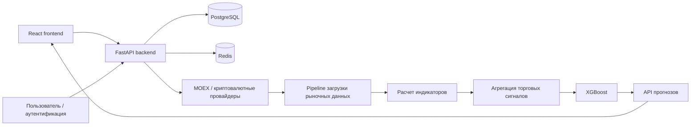

---

# Архитектура системы

**SwingTraderAI** построен вокруг центрального backend на **FastAPI**, который предоставляет API для React frontend и взаимодействует с базой данных PostgreSQL, Redis, источниками рыночных данных и аналитическими компонентами.

Система организована таким образом, чтобы разделить получение рыночных данных, их хранение, технический анализ, формирование торговых сигналов и машинное обучение.



## Основные компоненты

### Frontend

Директория:

```text
frontend/
```

Frontend-приложение построено на **Vite \+ React \+ TypeScript**.

Оно отвечает за взаимодействие пользователя с системой и включает страницы и компоненты для:

\* аутентификации; \* dashboard; \* watchlist; \* портфеля; \* анализа рынка; \* отображения результатов анализа.

Frontend взаимодействует с backend через HTTP API.

### FastAPI backend

Основная точка входа:

```text
swingtraderai/main.py
```

Backend отвечает за запуск приложения и объединение основных компонентов системы.

В `main.py` выполняются, в частности:

\* инициализация FastAPI; \* подключение CORS; \* настройка rate limiting; \* регистрация API-маршрутов; \* подключение middleware; \* запуск приложения.

### API

API-маршруты находятся в:

```text
swingtraderai/api/v1/
```

API предоставляет HTTP-интерфейс для основных операций системы:

\* аутентификация; \* пользователи; \* тикеры; \* рыночные данные; \* технические индикаторы; \* watchlist; \* административные функции; \* другие операции backend.

### PostgreSQL

PostgreSQL используется в качестве основной базы данных.

Модели расположены в:

```text
swingtraderai/db/models/
```

В базе данных хранятся данные, связанные с:

\* пользователями; \* рыночными данными; \* портфелями; \* торговыми сигналами; \* уведомлениями; \* watchlist; \* другими сущностями приложения.

Асинхронная работа с базой данных реализована через SQLAlchemy.

### Redis

Redis используется инфраструктурой фоновых задач и кэширования в соответствии с текущей конфигурацией проекта.

Он является частью общей инфраструктуры Docker Compose и используется совместно с Celery.

### Источники рыночных данных

Проект предусматривает получение рыночных данных из внешних источников.

В кодовой базе используются библиотеки и интеграции, связанные с:

\* **MOEX**; \* криптовалютными биржами через **CCXT**; \* финансовыми данными через **yfinance**.

Адаптеры и логика загрузки данных находятся в:

```text
swingtraderai/ingestion/
```

## Pipeline обработки рыночных данных

Одним из центральных процессов системы является последовательная обработка рыночных данных.

В упрощенном виде pipeline выглядит следующим образом:

```text
Источник данных
      ↓
Загрузка рыночных данных
      ↓
Нормализация / обработка
      ↓
PostgreSQL
      ↓
Расчет индикаторов
      ↓
Анализ структуры и характеристик цены
      ↓
Формирование признаков
      ↓
Агрегация сигналов
      ↓
ML-модель
      ↓
Прогноз
      ↓
API
      ↓
Frontend
```

Такой pipeline позволяет отделить получение данных от их анализа и последующего представления пользователю.

## Аналитический слой

Аналитическая часть системы расположена в:

```text
swingtraderai/indicators/
```

Здесь реализованы переиспользуемые компоненты технического анализа.

Индикаторы могут использоваться как отдельные признаки или как часть более комплексного торгового сценария.

С точки зрения концепции SwingTraderAI аналитический слой предназначен не просто для расчета большого количества индикаторов, а для формализации процесса анализа рынка.

Особое внимание уделяется сочетанию:

\* цены; \* рыночной структуры; \* уровней; \* объема; \* технических индикаторов; \* контекста движения.

Это позволяет постепенно приближать алгоритмический анализ к принципам активного и свингового трейдинга, которые лежат в методологической основе проекта.

## Формирование торговых сигналов

После расчета аналитических признаков система может объединять их в составную оценку торгового сценария.

Вместо зависимости от одного индикатора используется совокупность признаков.

Концептуально:

```text
Цена
  +
Структура рынка
  +
Уровни
  +
Объем
  +
Индикаторы
  ↓
Комплексная оценка
  ↓
Торговый сигнал
```

Такой подход соответствует общей идее проекта: **торговое решение должно учитывать рыночный контекст, а не основываться на одном техническом показателе**.

## ML-слой

Машинное обучение расположено в:

```text
swingtraderai/ml/
```

ML-компонент отвечает за обучение моделей и получение прогнозов для задач классификации.

В проекте используется **XGBoost**, а также инструменты экосистемы `scikit-learn`.

Упрощенная схема:

```text
Исторические данные
      ↓
Расчет признаков
      ↓
Dataset
      ↓
Обучение модели
      ↓
XGBoost
      ↓
Сохраненная модель
      ↓
Новые рыночные данные
      ↓
Prediction
```

ML-слой является дополнительным аналитическим компонентом. Он не заменяет технический анализ и не должен рассматриваться как самостоятельная система автоматического принятия торговых решений.

## Celery и фоновые задачи

Фоновые и асинхронные задачи находятся в:

```text
swingtraderai/tasks/
```

Для их выполнения используется **Celery**.

Задачи могут использоваться для:

\* загрузки рыночных данных; \* фоновой обработки; \* выполнения длительных операций; \* других asynchronous jobs.

Конфигурация Celery находится в:

```text
swingtraderai/celery.py
```

Redis используется в инфраструктуре фоновых задач согласно текущей конфигурации.

## Границы компонентов

Основные зависимости системы можно представить следующим образом:

| Компонент | Ответственность |
| --- | --- |
| React frontend | Интерфейс пользователя и отображение результатов |
| FastAPI | HTTP API и координация backend-компонентов |
| PostgreSQL | Постоянное хранение данных |
| Redis | Инфраструктура фоновых задач и связанные операции |
| Ingestion | Получение и сохранение рыночных данных |
| Indicators | Расчет технических показателей |
| Signal layer | Агрегация аналитических признаков и сигналов |
| ML | Обучение моделей и прогнозирование |
| Celery | Выполнение фоновых задач |

## Фактическое состояние архитектуры

Архитектуру необходимо рассматривать с учетом текущего состояния репозитория, а не как полностью завершенную production-систему.

На данный момент основной runtime-процесс сосредоточен вокруг:

1. получения рыночных данных; 2. хранения данных в PostgreSQL; 3. расчета технических индикаторов; 4. формирования комплексных аналитических сигналов; 5. ML-прогнозирования; 6. предоставления результатов через API; 7. отображения результатов во frontend.

В репозитории присутствуют зависимости и отдельные ссылки на AI- и Telegram-функциональность, однако **выделенного production-grade LLM orchestration-сервиса и подтвержденной полноценной реализации Telegram-бота в текущей архитектуре нет**.

Поэтому эти компоненты не следует описывать как гарантированно работающие части основного runtime-процесса.

## Архитектурная связь с торговой методологией

SwingTraderAI создается как система формализации торгового анализа, основанная на принципах активного и свингового трейдинга.

Методологическая основа проекта включает идеи, связанные с:

\* анализом ценовых уровней; \* чтением поведения цены; \* анализом рыночной структуры; \* использованием объема; \* поиском торговых сценариев; \* оценкой точки входа и выхода; \* соотношением риска и потенциальной прибыли; \* подтверждением торгового сценария несколькими факторами.

При этом архитектура сознательно разделяет **методологию**, **алгоритмическую реализацию** и **ML-прогнозирование**.

Это позволяет тестировать отдельные элементы стратегии независимо и постепенно переводить практические торговые принципы в формализованные правила и вычисляемые признаки.

## Известная конфигурационная проблема

В текущем `docker-compose.yml` объявлен сервис `ml-worker`, который зависит от `rabbitmq`, однако сам сервис `rabbitmq` в текущем Compose-файле явно не определен.

Это следует рассматривать как **конфигурационный пробел**, а не как подтверждение наличия RabbitMQ в рабочей runtime-архитектуре.

При запуске Docker Compose данная зависимость может потребовать дополнительной настройки.

## Исходный код

\* [Инициализация приложения](https://github.com/BulatNS31/SwingTraderAI/blob/main/swingtraderai/main.py) \* [Конфигурация Celery](https://github.com/BulatNS31/SwingTraderAI/blob/main/swingtraderai/celery.py) \* [Сессия базы данных](https://github.com/BulatNS31/SwingTraderAI/blob/main/swingtraderai/db/session.py) \* [Frontend router](https://github.com/BulatNS31/SwingTraderAI/blob/main/frontend/src/app/router.tsx)