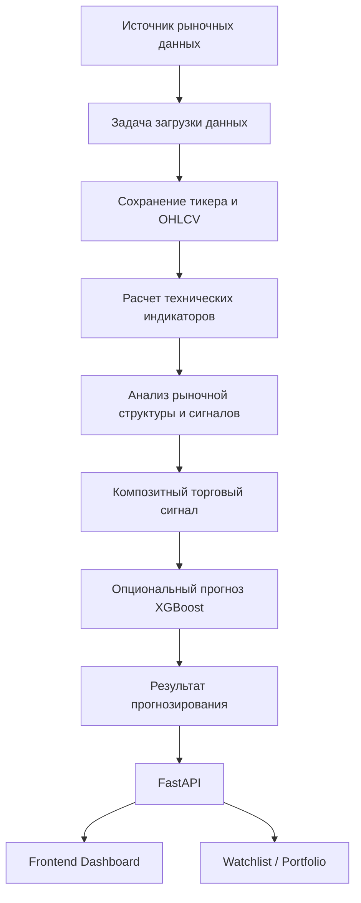
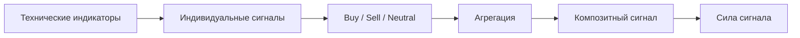
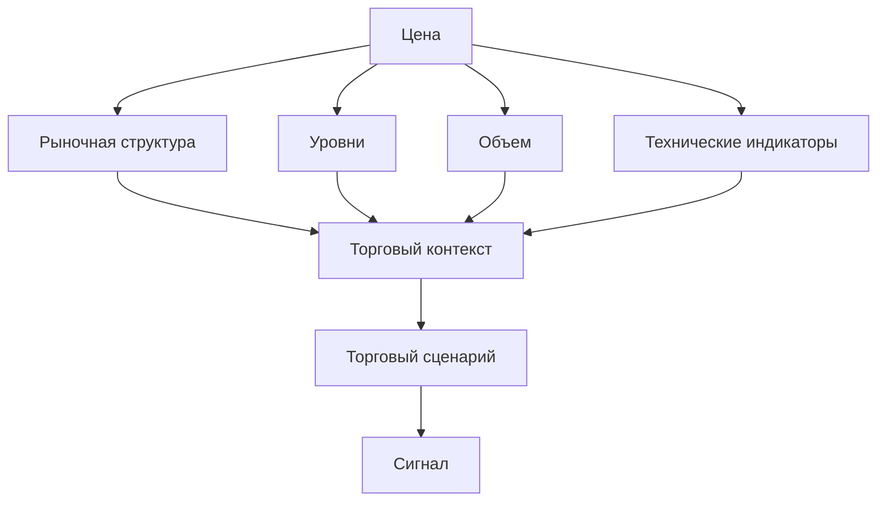
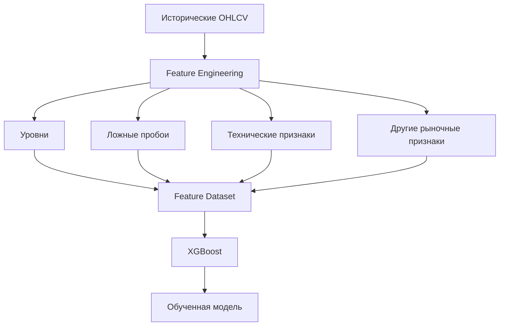
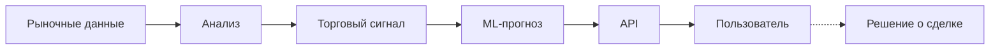
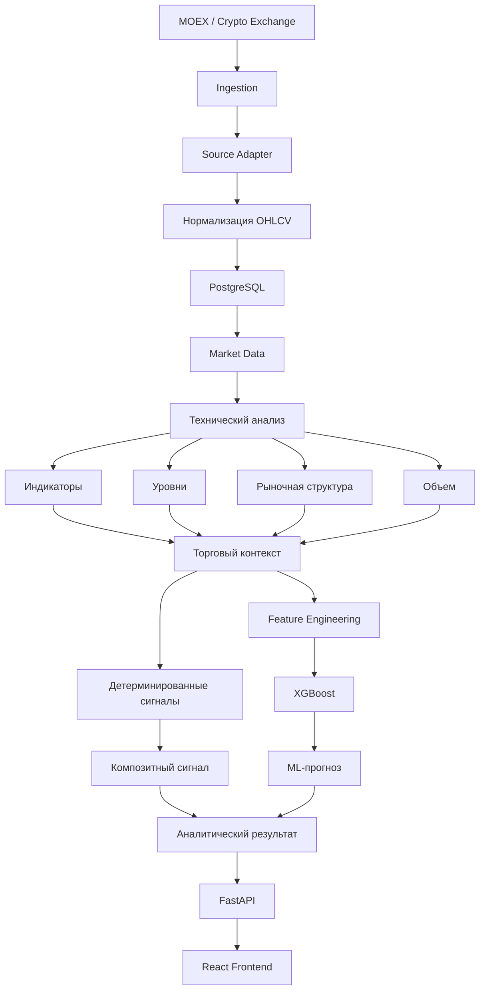

---

# Торговый pipeline

**SwingTraderAI** реализует backend-ориентированный pipeline анализа рынка, а не полноценную систему автоматического исполнения сделок.

Основная задача системы заключается в том, чтобы получить рыночные данные, сохранить их, провести технический анализ, сформировать торговый сигнал и, при необходимости, дополнить его прогнозом ML-модели.

Архитектурно процесс выглядит следующим образом:



## Методологическая основа

Торговая логика SwingTraderAI ориентирована на принципы активного и свингового трейдинга.

При формировании аналитического подхода учитываются идеи и методы, представленные в работах:

\* **Александр Герчик**: «Курс активного трейдера», «Покупай, продавай, зарабатывай», «Малая энциклопедия трейдера»; \* **Эрик Л. Найман**: «Малая энциклопедия трейдера»; \* **John F. Carter**: _Mastering the Trade_, 3rd Edition; \* **Thomas Bulkowski**: _Swing and Day Trading: Evolution of a Trader_.

Особое внимание уделяется:

\* ценовому движению; \* уровням поддержки и сопротивления; \* рыночной структуре; \* объему; \* пробоям и ложным пробоям; \* техническим индикаторам; \* подтверждению торгового сценария совокупностью факторов.

При этом библиотечные индикаторы сами по себе не являются торговой стратегией. Они выступают частью более широкой системы оценки рыночного контекста.

## 1. Источник рыночных данных

Система получает рыночные данные от внешних источников.

В текущем проекте предусмотрена работа с:

\* **MOEX**; \* криптовалютными биржами; \* другими источниками через соответствующие классы-провайдеры.

Основная задача загрузки данных находится в:

```text
swingtraderai/tasks/ingestion.py
```

Источники реализованы через базовые классы и адаптеры в:

```text
swingtraderai/ingestion/sources/
```

Таким образом, внешний источник данных отделен от внутренней логики обработки.

## 2. Нормализация и сохранение данных

После получения данных выполняется их приведение к единому формату.

В `swingtraderai/ingestion/saver.py` используются:

```text
ensure_ticker()
upsert_market_data_batch()
```

Они отвечают за:

1. определение или создание тикера; 2. подготовку рыночных данных; 3. сохранение OHLCV; 4. обновление существующих записей.

Общий формат данных определен в:

```text
swingtraderai/schemas/market_data.py
```

После обработки данные сохраняются в таблицу:

```text
market_data
```

в PostgreSQL.

## 3. Расчет технических индикаторов

Система технического анализа расположена в:

```text
swingtraderai/indicators/
```

Она использует:

\* `pandas_ta`; \* собственные функции и реализации индикаторов; \* централизованный реестр индикаторов.

Реестр находится в:

```text
swingtraderai/indicators/registry.py
```

Через:

```text
IndicatorService.get_indicators()
```

система рассчитывает необходимые индикаторы для конкретного тикера и таймфрейма.

Это позволяет не рассчитывать весь набор показателей без необходимости, а запрашивать только требуемые аналитические данные.

## 4. Анализ торгового сценария и формирование сигнала

После расчета индикаторов система переходит к формированию торгового сигнала.

Основная логика находится в:

```text
IndicatorService.get_signals()
```

Метод обрабатывает зарегистрированные индикаторы, получает числовые значения сигналов и агрегирует результаты.

В результате формируется композитный сигнал, например:

\* `BUY`; \* `SELL`; \* `STRONG_BUY`; \* `NEUTRAL`.

Упрощенно:



Важно, что этот этап является **детерминированным**.

То есть одинаковые входные данные и одинаковые настройки должны приводить к одинаковому результату. Здесь нет необходимости доверять языковой модели, которая внезапно решила, что RSI сегодня «чувствует себя медвежьим».

## 5. Анализ рыночной структуры

Помимо стандартных технических индикаторов, ML-часть проекта использует признаки, связанные с рыночной структурой.

В частности, в feature engineering используются:

\* уровни поддержки и сопротивления; \* признаки ложных пробоев; \* характеристики ценового движения; \* технические признаки.

Это соответствует общей концепции SwingTraderAI, в которой торговый сценарий оценивается не по одному индикатору, а по совокупности факторов.

Упрощенная модель анализа:



## 6. ML-анализ

Обучение и inference находятся в:

```text
swingtraderai/ml/trainer.py
swingtraderai/ml/inference.py
```

В качестве модели используется **XGBoost-классификатор**.

Модель работает не напрямую с необработанными свечами, а с подготовленным набором признаков.

Общий процесс:



При использовании модели новые рыночные данные проходят через соответствующий pipeline формирования признаков, после чего XGBoost выдает прогноз.

## 7. Финальный аналитический результат

Финальная точка текущего pipeline представляет собой **результат анализа и прогнозирования**, который передается через API.

Это принципиальное ограничение текущей архитектуры.

Система:

```text
получает данные
    ↓
анализирует рынок
    ↓
формирует сигнал
    ↓
при необходимости использует ML
    ↓
возвращает результат
```

Она **не выполняет автоматически торговый приказ у брокера**.

То есть:



Последний шаг остается за пользователем или внешней системой исполнения, поскольку автоматический механизм отправки ордеров в текущем репозитории не реализован.

## Полный торговый pipeline

С учетом всех основных компонентов SwingTraderAI полный поток можно представить следующим образом:



## Реализация торговой логики

С точки зрения архитектуры торговый анализ можно разделить на несколько независимых уровней:

| Уровень | Назначение | Статус |
| --- | --- | --- |
| Рыночные данные | Получение OHLCV | Реализовано |
| Хранение | PostgreSQL | Реализовано |
| Технический анализ | Расчет индикаторов | Реализовано |
| Рыночная структура | Уровни, пробои и связанные признаки | Реализовано частично в зависимости от сценария |
| Сигнальный движок | Детерминированная агрегация сигналов | Реализовано |
| ML | Обучение и прогнозирование XGBoost | Реализовано |
| AI/LLM | Интерпретация результатов | Архитектурное направление / частично |
| Брокерская интеграция | Передача торговых приказов | Не реализовано |
| Автоматическое исполнение | Открытие и закрытие позиций | Не реализовано |

## Важное ограничение

**SwingTraderAI не является полноценным автоматическим торговым роботом.**

Текущая реализация представляет собой систему **рыночного анализа и генерации торговых сигналов**, которая объединяет:

\* рыночные данные; \* технические индикаторы; \* уровни; \* рыночную структуру; \* объем; \* правила формирования сигналов; \* ML-прогнозирование; \* API и пользовательский интерфейс.

Автоматическое исполнение ордеров через брокера в текущем репозитории отсутствует.

Поэтому корректная модель системы:

\> **SwingTraderAI анализирует рынок, формирует торговый сценарий и предоставляет аналитический результат, но не принимает на себя функцию брокера и не выполняет сделки автоматически.**

## Исходный код

\* [Задача загрузки данных](https://github.com/BulatNS31/SwingTraderAI/blob/main/swingtraderai/tasks/ingestion.py) \* [Сохранение рыночных данных](https://github.com/BulatNS31/SwingTraderAI/blob/main/swingtraderai/ingestion/saver.py) \* [Реестр индикаторов](https://github.com/BulatNS31/SwingTraderAI/blob/main/swingtraderai/indicators/registry.py) \* [Сервис индикаторов](https://github.com/BulatNS31/SwingTraderAI/blob/main/swingtraderai/api/services/indicator_service.py) \* [ML trainer](https://github.com/BulatNS31/SwingTraderAI/blob/main/swingtraderai/ml/trainer.py) \* [ML inference](https://github.com/BulatNS31/SwingTraderAI/blob/main/swingtraderai/ml/inference.py)