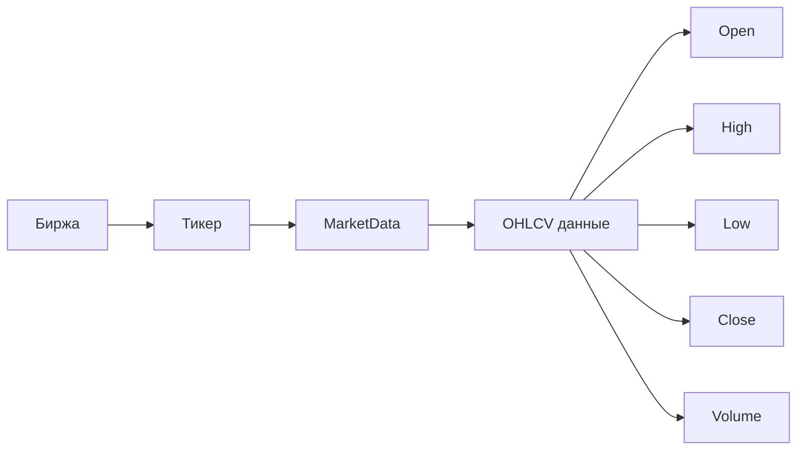
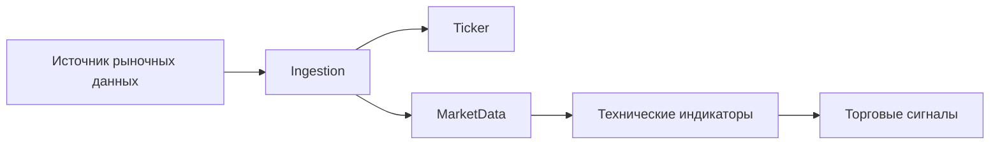
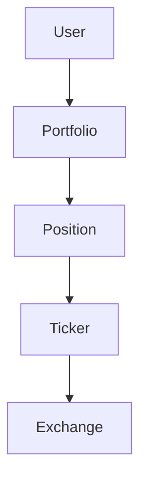
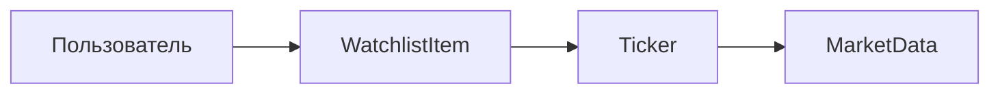
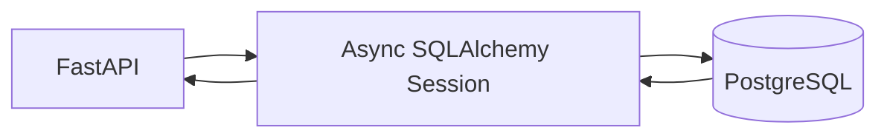
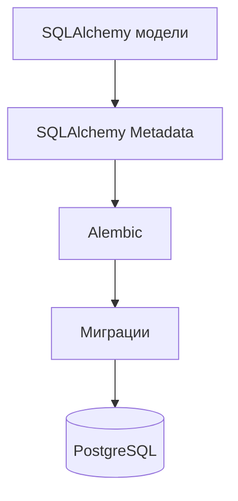

# База данных

В SwingTraderAI используется **PostgreSQL** в связке с **SQLAlchemy** и асинхронным управлением сессиями.

Основная конфигурация базы данных находится в директории:

` swingtraderai/db/ `

## Основные таблицы и модели

В проекте определены следующие основные сущности:

- `User` — пользователь приложения, данные аутентификации, роли и информация об аккаунте.
- `Ticker` — информация о торговом инструменте и его тикере.
- `MarketData` — рыночные данные, включая OHLCV и ценовые свечи.
- `Portfolio` — пользовательский портфель.
- `Position` — позиции пользователя в торговых инструментах.
- `WatchlistItem` — инструменты, добавленные пользователем в список наблюдения.
- `Exchange` — информация о биржах и источниках рыночных данных.

Основные файлы:

- `swingtraderai/db/models/user.py`
- `swingtraderai/db/models/market.py`
- `swingtraderai/db/models/portfolio.py`
- `swingtraderai/db/base.py`
- `swingtraderai/db/session.py`

## Структура взаимосвязей

Упрощённую структуру основных сущностей можно представить следующим образом:

```mermaid
erDiagram
    USER ||--o{ POSITION : "имеет"
    USER ||--o{ WATCHLIST_ITEM : "добавляет"
    USER ||--|| PORTFOLIO : "владеет"

    TICKER ||--o{ MARKET_DATA : "содержит"
    EXCHANGE ||--o{ TICKER : "предоставляет"

    USER {
        uuid id
        string email
        string role
    }

    PORTFOLIO {
        uuid id
        uuid user_id
    }

    POSITION {
        uuid id
        uuid user_id
        uuid ticker_id
    }

    WATCHLIST_ITEM {
        uuid id
        uuid user_id
        uuid ticker_id
    }

    TICKER {
        uuid id
        string symbol
        uuid exchange_id
    }

    MARKET_DATA {
        uuid id
        uuid ticker_id
        datetime timestamp
        float open
        float high
        float low
        float close
        float volume
    }

    EXCHANGE {
        uuid id
        string name
    }
````

> Диаграмма показывает логическую структуру связей между основными сущностями. Она является упрощённым представлением модели и не предназначена для отображения каждого поля базы данных.

## Связь пользователя с данными

Основные пользовательские данные связаны с конкретным пользователем через портфель, позиции и список наблюдения.

```mermaid
flowchart TD
    USER[Пользователь] --> PORTFOLIO[Портфель]
    USER --> POSITION[Позиции]
    USER --> WATCHLIST[Список наблюдения]

    PORTFOLIO --> POSITION
    POSITION --> TICKER[Торговый инструмент]
    WATCHLIST --> TICKER

    TICKER --> MARKET[Рыночные данные]
```

Таким образом, пользователь может:

* иметь собственный портфель;
* хранить торговые позиции;
* отслеживать выбранные инструменты;
* получать рыночные данные по этим инструментам.

## Связь рыночных данных

Рыночная часть базы данных организована вокруг торгового инструмента (`Ticker`).



Один `Exchange` может содержать множество торговых инструментов.

Один `Ticker` может иметь множество записей `MarketData`, соответствующих различным временным интервалам и моментам времени.

## Поток рыночных данных

Рыночные данные поступают из внешних источников, сохраняются в базе данных и затем используются аналитическими компонентами системы.



Таким образом, база данных является центральным слоем хранения между загрузкой рыночных данных и последующим анализом.

## Портфель и позиции

Портфельная часть предназначена для хранения состояния пользовательского портфеля и связанных с ним позиций.



`Position` связывает пользователя с конкретным торговым инструментом через портфельную структуру.

## Список наблюдения

Список наблюдения позволяет пользователю сохранять интересующие его торговые инструменты.



Это позволяет использовать один и тот же объект `Ticker` как для рыночного анализа, так и для пользовательских функций, например списка наблюдения и позиций.

## Асинхронный доступ к базе данных

Для работы с PostgreSQL используется асинхронная модель SQLAlchemy.

Основная логика управления сессиями находится в:

```text
swingtraderai/db/session.py
```

Упрощённый принцип работы:



API обращается к базе данных через асинхронную SQLAlchemy-сессию, что позволяет не блокировать обработку других запросов во время операций ввода-вывода.

## Миграции и создание схемы

Проект использует SQLAlchemy для описания моделей и **Alembic** для управления миграциями базы данных.



При запуске приложения конфигурация в `swingtraderai/main.py` также предусматривает создание таблиц через SQLAlchemy metadata.

Для применения миграций используется:

```bash
alembic upgrade head
```

## Мультитенантность

В проекте присутствуют абстракции, связанные с мультитенантностью и разделением данных между арендаторами.

При этом текущая реализация не подтверждает наличие полностью централизованной политики изоляции данных на уровне всей базы данных.

Поэтому мультитенантность следует рассматривать как часть архитектурного дизайна проекта, а не как полностью подтверждённый механизм изоляции каждой записи на уровне PostgreSQL.

## Полнота реализации

База данных проекта ориентирована прежде всего на задачи **рыночного анализа и управления пользовательскими аналитическими данными**.

В ней реализованы:

* пользователи;
* торговые инструменты;
* рыночные данные;
* биржи;
* портфели;
* позиции;
* списки наблюдения.

При этом схема не представляет собой полноценный брокерский ledger или систему исполнения сделок.

То есть база данных хранит необходимые данные для аналитической платформы, но сама по себе не является системой исполнения торговых операций.

## Ссылки на исходный код

* [Сессия базы данных](https://github.com/BulatNS31/SwingTraderAI/blob/main/swingtraderai/db/session.py)
* [Модель пользователя](https://github.com/BulatNS31/SwingTraderAI/blob/main/swingtraderai/db/models/user.py)
* [Модели рынка](https://github.com/BulatNS31/SwingTraderAI/blob/main/swingtraderai/db/models/market.py)
* [Модель портфеля](https://github.com/BulatNS31/SwingTraderAI/blob/main/swingtraderai/db/models/portfolio.py)
