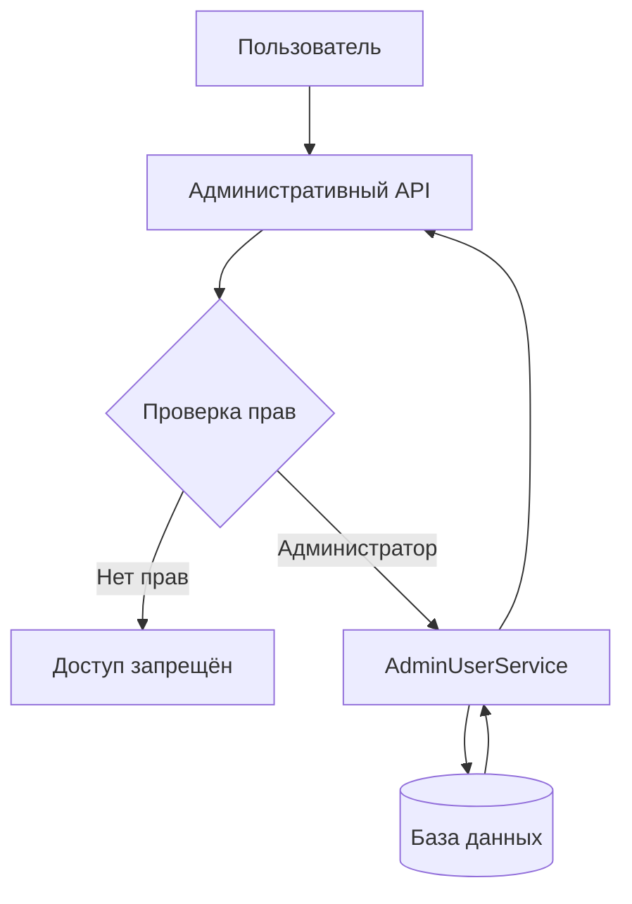

# Панель администратора

Панель администратора предназначена для управления пользователями и контроля работы торгово-аналитической платформы.

Администратор имеет отдельные API-маршруты и интерфейс во frontend. Доступ к административным операциям защищён проверкой прав администратора.

## Управление пользователями

Администратор может управлять пользователями системы.

В backend для этого используется отдельный набор маршрутов:

```text
/users
/users/{user_id}
/users/{user_id}/status
/users/{user_id}/role
````

Все эти маршруты защищены зависимостью `get_current_admin`, поэтому выполнять административные операции может только пользователь с соответствующими правами.

## Возможности администратора

### Просмотр списка пользователей

Администратор может получить список пользователей с использованием фильтров и пагинации.

```http
GET /users
```

Используется:

```text
UserListFilters
AdminUserService.list_users()
```

Это позволяет находить нужных пользователей без необходимости просматривать весь список вручную. Человечество всё-таки иногда изобретает фильтры не зря.

### Просмотр пользователя

Администратор может открыть подробную информацию о конкретном пользователе:

```http
GET /users/{user_id}
```

Для получения данных используется:

```text
AdminUserService.get_user_detail()
```

### Блокировка и разблокировка пользователя

Администратор может изменить статус пользователя:

```http
PATCH /users/{user_id}/status
```

Операция выполняется через:

```text
AdminUserService.update_ban_status()
```

Таким образом, административная панель позволяет управлять доступом пользователя к системе.

### Изменение роли пользователя

Администратор может изменить роль пользователя:

```http
PATCH /users/{user_id}/role
```

Для этого используется:

```text
UserUpdateRole
AdminUserService.change_role()
```

При изменении роли выполняются дополнительные проверки.

## Диагностика проблем пользователя

Административная панель предназначена не только для управления аккаунтами.

Она также должна использоваться как инструмент диагностики проблем, возникающих у пользователей во время работы с торговой платформой.

Например, пользователь может отправить менеджеру или администратору:

* скриншот ошибки;
* код ошибки;
* идентификатор сделки;
* описание проблемы;
* информацию о том, при каком действии возникла ошибка.

Администратор после этого может найти соответствующего пользователя и исследовать его данные.

## Работа со сделками пользователя

Если пользователь сообщает об ошибке в конкретной сделке и предоставляет её `ID`, менеджер или администратор может открыть эту сделку в административном интерфейсе.

Также должна быть возможность просмотреть все сделки пользователя.

Упрощённый сценарий:

```text
Пользователь
    ↓
Ошибка / скриншот / ID сделки
    ↓
Менеджер или администратор
    ↓
Поиск пользователя
    ↓
Открытие сделки по ID
    ↓
Просмотр данных сделки
    ↓
Анализ ошибки
```

Если проблема не связана с конкретной сделкой, администратор может перейти к истории сделок пользователя и найти соответствующий сценарий самостоятельно.

## Диагностика без вмешательства в торговлю

Важное ограничение административного доступа:

**администратор не может открывать торговую позицию за пользователя.**

Администратор может:

* просматривать данные пользователя;
* просматривать сделки;
* открывать конкретную сделку по ID;
* просматривать историю сделок;
* анализировать ошибки;
* исследовать состояние торгового сценария;
* управлять статусом пользователя;
* изменять роль пользователя.

Но административный доступ не должен превращаться в возможность совершать торговые операции от имени пользователя.

То есть:

```text
Администратор
      │
      ├── Просмотр пользователя       ✓
      ├── Просмотр сделок             ✓
      ├── Поиск сделки по ID          ✓
      ├── Анализ ошибки               ✓
      ├── Управление пользователем    ✓
      │
      └── Открытие позиции за пользователя  ✗
```

## Разделение ролей

Административная часть системы должна учитывать различие между обычным пользователем, менеджером и администратором.

Основной принцип:

| Возможность                              | Пользователь |            Менеджер | Администратор |
| ---------------------------------------- | -----------: | ------------------: | ------------: |
| Работа со своим аккаунтом                |           Да |                  Да |            Да |
| Просмотр собственных сделок              |           Да |                  Да |            Да |
| Просмотр пользователей                   |          Нет |                  Да |            Да |
| Просмотр сделок другого пользователя     |          Нет |                  Да |            Да |
| Поиск сделки по ID                       |  Только свои |                  Да |            Да |
| Диагностика ошибок пользователя          |          Нет |                  Да |            Да |
| Блокировка пользователя                  |          Нет | По правилам системы |            Да |
| Изменение роли                           |          Нет |                 Нет |            Да |
| Открытие позиции за другого пользователя |          Нет |                 Нет |           Нет |

Конкретный набор разрешений менеджера определяется фактической системой ролей и политикой доступа.

## Защита административных маршрутов

Backend использует:

```python
dependencies=[Depends(get_current_admin)]
```

Это означает, что административный router требует прохождения проверки `get_current_admin`.

Таким образом, запросы к административным маршрутам не должны выполняться обычными пользователями.

Основной поток проверки выглядит так:



## Архитектура административного API

Административные маршруты отделены от основной пользовательской логики.

Текущая реализация использует:

```text
swingtraderai/api/v1/admin.py
```

и сервис:

```text
swingtraderai/api/services/admin/user_service.py
```

Основные схемы запросов:

```text
UserBanAction
UserListFilters
UserUpdateRole
```

Ответы пользователей используют:

```text
UserOut
```

## Практический сценарий диагностики

Типичный сценарий работы менеджера или администратора может выглядеть следующим образом:

1. Пользователь сообщает об ошибке.
2. Пользователь отправляет скриншот или код ошибки.
3. Если известен `user_id`, администратор находит пользователя.
4. Если известен `trade_id`, администратор открывает конкретную сделку.
5. Если `trade_id` неизвестен, администратор просматривает сделки пользователя.
6. Администратор анализирует параметры сделки и связанные данные.
7. Определяется причина ошибки.
8. Пользователю предоставляется решение или проблема передаётся разработчикам.

Административная панель в таком случае становится не просто страницей управления пользователями, а **операционным инструментом поддержки и диагностики торговой платформы**.

## Статус реализации

В backend уже подтверждены следующие административные возможности:

* получение списка пользователей;
* фильтрация и пагинация пользователей;
* просмотр конкретного пользователя;
* блокировка и разблокировка пользователя;
* изменение роли пользователя;
* защита административных маршрутов через `get_current_admin`.

Функциональность просмотра и диагностики сделок пользователя должна рассматриваться как отдельная часть административного интерфейса. Если соответствующие маршруты и UI уже реализованы в других модулях проекта, они должны быть связаны с административным сценарием поддержки.

При этом **административный доступ не должен предоставлять возможность открывать торговые позиции за пользователя**.

## Ссылки на исходный код

* [Backend admin routes](https://github.com/BulatNS31/SwingTraderAI/blob/main/swingtraderai/api/v1/admin.py)
* [Frontend router](https://github.com/BulatNS31/SwingTraderAI/blob/main/frontend/src/app/router.tsx)
