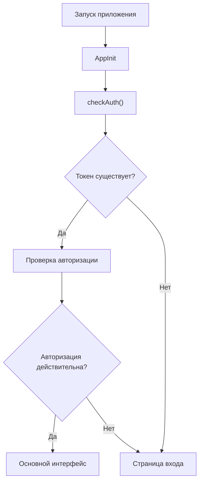
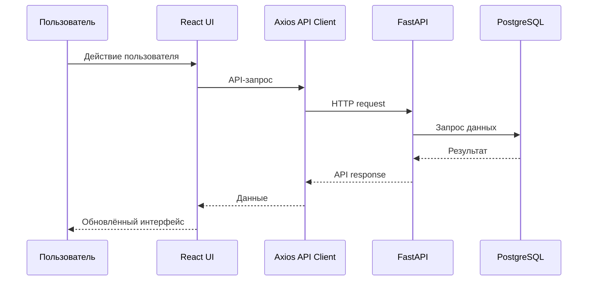

# Обзор frontend

Frontend представляет собой одностраничное приложение (SPA) на **React + TypeScript**, собранное с использованием **Vite** и расположенное в директории `frontend/src/`.

Frontend отвечает за пользовательский интерфейс SwingTraderAI: отображение рыночных данных, аналитики, торговых сигналов, портфеля, watchlist и административных разделов.

## Архитектура взаимодействия

Frontend не содержит основной бизнес-логики торгового анализа. Он взаимодействует с backend через REST API.

Основной поток выглядит следующим образом:

```mermaid
flowchart LR
    USER[Пользователь] --> UI[React frontend]
    UI --> AUTH[Состояние авторизации]
    UI --> API[Axios API Client]
    API --> BACKEND[FastAPI /api/v1]
    BACKEND --> DB[(PostgreSQL)]
    BACKEND --> ANALYSIS[Анализ рынка]
    ANALYSIS --> API
    API --> UI
````

Таким образом, frontend выполняет роль клиентского интерфейса, а основная логика обработки данных и анализа находится на backend.

## Структура маршрутов

Дерево маршрутов определено в:

```text
frontend/src/app/router.tsx
```

Основные маршруты приложения:

* `/login` — вход в систему
* `/register` — регистрация
* `/dashboard` — главная панель
* `/markets` — рынки
* `/analytics` — аналитика
* `/signals` — торговые сигналы
* `/watchlist` — список отслеживаемых инструментов
* `/portfolio` — портфель
* `/ticker/:symbol` — детальная информация по тикеру
* `/admin/users` — управление пользователями
* `/admin/ml-training` — обучение ML-моделей
* `/admin/system-status` — состояние системы

## Поток авторизации

Для управления состоянием авторизации frontend использует **Zustand**.

При запуске приложения выполняется проверка текущей авторизации через `checkAuth()` в `AppInit`. Только после этого приложение переходит к отображению маршрутизируемого интерфейса.

Упрощённый процесс:



### Основные файлы

```text
frontend/src/App.tsx
frontend/src/features/auth/store/auth-store.ts
frontend/src/shared/api/api-client.ts
```

## Управление состоянием

Для клиентского состояния используется **Zustand**.

В частности, Zustand используется для хранения состояния авторизации и связанных с ней данных.

Frontend также использует менеджер токенов для локального хранения токенов авторизации.

Общая схема:

```text
Пользователь
    ↓
Login / Register
    ↓
API Client
    ↓
FastAPI
    ↓
JWT
    ↓
Token Manager
    ↓
Zustand Auth Store
    ↓
React UI
```

## Взаимодействие с API

Frontend использует централизованный объект `apiClient`, основанный на **Axios**.

Основной API-клиент находится в:

```text
frontend/src/shared/api/api-client.ts
```

Через него frontend взаимодействует с backend для получения и изменения данных.

Основные направления API:

* авторизация;
* пользователи;
* тикеры;
* рыночные данные;
* watchlist;
* портфель;
* технические индикаторы;
* торговые сигналы.

Backend API организован через маршруты:

```text
/api/v1/*
```

Общая схема взаимодействия:



## Работа с авторизацией API

Для входа frontend взаимодействует с backend через API-клиент.

API-клиент отвечает за:

* отправку данных авторизации;
* формирование `form-data` для login-запроса;
* обработку ответов API;
* валидацию полученных данных;
* работу с токенами.

Таким образом, frontend не реализует собственную систему аутентификации, а использует механизм авторизации backend.

## Основные области интерфейса

Проект содержит пользовательские страницы для различных задач.

### Авторизация

* вход;
* регистрация;
* управление состоянием авторизации.

### Dashboard

Главная рабочая область пользователя.

Здесь frontend может объединять основную информацию о рынке и состоянии пользовательского аккаунта.

### Рынки и аналитика

Разделы:

* рынки;
* аналитика;
* технические показатели;
* рыночные данные.

Они используются для анализа инструментов и отображения результатов работы backend.

### Торговые сигналы

Раздел `/signals` предназначен для отображения торговых сигналов, сформированных аналитическим backend.

Сигнал является результатом обработки рыночных данных и технического анализа.

### Watchlist

Раздел `/watchlist` позволяет пользователю работать со списком отслеживаемых инструментов.

### Portfolio

Раздел `/portfolio` предназначен для отображения информации о пользовательском портфеле и позициях.

### Страница тикера

Маршрут:

```text
/ticker/:symbol
```

используется для отображения детальной информации по конкретному торговому инструменту.

Например:

```text
/ticker/SBER
```

Страница тикера является одной из ключевых точек взаимодействия frontend с аналитическим backend.

### AI-разделы

В структуре frontend присутствуют разделы, связанные с AI, включая:

* AI Chat;
* AI Lab.

При этом наличие соответствующих страниц frontend не означает, что вся AI-функциональность полностью реализована на backend. Фактические возможности AI-слоя необходимо рассматривать отдельно.

### Административная часть

Frontend содержит административные разделы:

* управление пользователями;
* обучение ML-моделей;
* мониторинг состояния системы.

Эти разделы предназначены для управления и контроля backend-инфраструктуры.

## Организация исходного кода

Основные директории frontend:

```text
frontend/src/
├── app/
├── features/
├── pages/
└── shared/
```

### `app/`

Содержит основную конфигурацию приложения.

В частности:

```text
frontend/src/app/router.tsx
```

отвечает за маршрутизацию.

### `features/`

Содержит функциональные модули приложения, например:

* авторизация;
* watchlist;
* рынки;
* административные функции.

Такой подход позволяет группировать код по бизнес-функциональности.

### `pages/`

Содержит страницы приложения, которые соответствуют пользовательским маршрутам.

### `shared/`

Содержит общий код, используемый несколькими частями приложения.

Например:

```text
frontend/src/shared/api/api-client.ts
```

содержит централизованный API-клиент.

## Реализация frontend

Frontend представляет собой полноценную клиентскую часть приложения, построенную на:

* React;
* TypeScript;
* Vite;
* Zustand;
* Axios.

При этом frontend является клиентом backend API, а не самостоятельной системой анализа.

Основная ответственность разделена следующим образом:

| Компонент  | Ответственность             |
| ---------- | --------------------------- |
| React      | Пользовательский интерфейс  |
| TypeScript | Типизация frontend-кода     |
| Vite       | Сборка и development server |
| Zustand    | Клиентское состояние        |
| Axios      | Взаимодействие с API        |
| FastAPI    | Backend и бизнес-логика     |
| PostgreSQL | Хранение данных             |

## Примечания по реализации

Frontend явно ориентирован на полноценный пользовательский интерфейс торгово-аналитической платформы.

При этом наличие маршрута или страницы само по себе не означает, что соответствующая функциональность полностью завершена на backend. В качестве основного контракта между frontend и backend следует рассматривать REST API, реализованный через маршруты `api/v1`.

Главная архитектурная идея заключается в разделении ответственности:

```text
Frontend
    ↓
Отображение и взаимодействие с пользователем
    ↓
REST API
    ↓
Backend
    ↓
Бизнес-логика и анализ
    ↓
PostgreSQL / Redis / внешние источники данных
```

## Ссылки на исходный код

* [Frontend router](https://github.com/BulatNS31/SwingTraderAI/blob/main/frontend/src/app/router.tsx)
* [App initialization](https://github.com/BulatNS31/SwingTraderAI/blob/main/frontend/src/App.tsx)
* [API client](https://github.com/BulatNS31/SwingTraderAI/blob/main/frontend/src/shared/api/api-client.ts)
