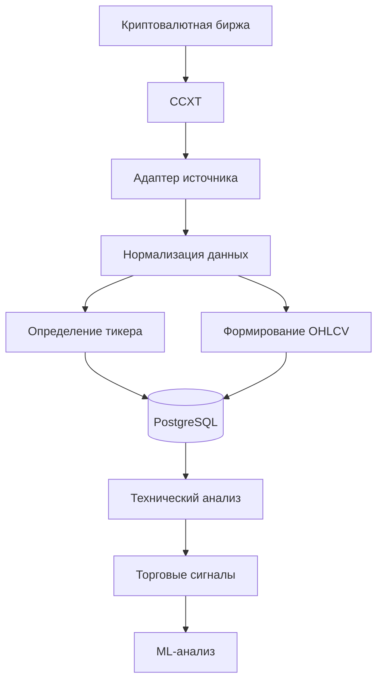
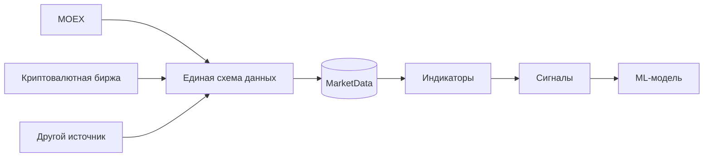

# Криптовалютные биржи

Проект поддерживает работу с данными криптовалютных бирж. Для взаимодействия с различными криптовалютными площадками в зависимостях проекта используется библиотека `ccxt`.

Интеграция с криптовалютными биржами является частью общего слоя загрузки рыночных данных. Полученные данные проходят нормализацию и приводятся к единому формату перед сохранением в базе данных.

## Поддерживаемые компоненты

В проекте используется:

- `ccxt` — библиотека для взаимодействия с API криптовалютных бирж;
- общий ingestion-слой для получения и обработки рыночных данных;
- адаптеры источников, расположенные в `swingtraderai/ingestion/sources/`;
- единая модель хранения рыночных данных.

Зависимость `ccxt` определена в:

```text
pyproject.toml
````

## Модель интеграции

Работа с криптовалютными биржами встроена в общую архитектуру загрузки рыночных данных.

Процесс выглядит следующим образом:



Таким образом, конкретная биржа является источником данных, а дальнейшая обработка выполняется общими компонентами проекта.

## Рыночные данные

В первую очередь система работает со стандартными OHLCV-данными:

* **Open** — цена открытия;
* **High** — максимальная цена;
* **Low** — минимальная цена;
* **Close** — цена закрытия;
* **Volume** — объём торгов.

После получения данные приводятся к общей структуре, что позволяет использовать их для расчёта индикаторов, определения уровней и формирования торговых сигналов.

## Единая схема данных

Основное преимущество такого подхода заключается в том, что аналитическая часть проекта не должна знать, откуда именно были получены данные.

Например:



После нормализации данные от разных источников могут использоваться одним и тем же аналитическим контуром.

## Особенности интеграции

При работе с криптовалютными биржами необходимо учитывать особенности их API и торговой инфраструктуры.

### Ограничения API

Биржи устанавливают ограничения на количество запросов. При разработке и эксплуатации адаптеров необходимо учитывать:

* rate limits;
* частоту обновления данных;
* ограничения конкретной биржи;
* возможные временные ошибки API.

Превышение лимитов может привести к временной блокировке запросов или ошибкам получения данных.

### Временные зоны

Криптовалютный рынок работает круглосуточно, в отличие от традиционных фондовых бирж.

При обработке данных необходимо корректно учитывать:

* временные метки свечей;
* часовые пояса;
* интервалы OHLCV;
* синхронизацию данных между источниками.

Это особенно важно для технического анализа, поскольку смещение временных интервалов может повлиять на расчёт индикаторов и торговых сигналов.

### API-ключи

Для получения публичных рыночных данных API-ключ может не требоваться.

Однако отдельные операции и приватные API бирж требуют аутентификации. При подключении таких функций ключи API должны храниться в переменных окружения или другом безопасном хранилище, а не непосредственно в исходном коде.

### Повторные запросы

При временных ошибках API необходимо использовать повторные попытки с задержкой между запросами.

В проекте присутствует зависимость `tenacity`, которая предназначена для реализации retry/backoff-механизмов.

## Использование в торговом анализе

Полученные данные криптовалютных рынков могут проходить тот же аналитический процесс, что и данные других рынков:

1. получение рыночных данных;
2. нормализация;
3. сохранение OHLCV;
4. расчёт технических индикаторов;
5. определение уровней и структуры цены;
6. формирование композитного торгового сигнала;
7. дополнительная ML-классификация;
8. передача результата через API.

Подход к анализу ориентирован на принятие торговых решений на основе структуры рынка, уровней, объёма, технических индикаторов и подтверждающих сигналов.

## Концепция анализа

Криптовалютные данные используются не просто для отображения котировок, а как входные данные для аналитической системы.

Концепция проекта развивается с учётом подходов к торговле по уровням, анализу структуры цены, ложных пробоев, объёмов и подтверждения торгового сценария. В качестве методологической основы используются идеи Александра Герчика и материалы:

* «Курс активного трейдера»;
* «Покупай, продавай, зарабатывай»;
* «Малая энциклопедия трейдера» — Эрик Л. Найман;
* **Mastering the Trade, 3rd Edition** — John F. Carter;
* **Swing and Day Trading: Evolution of a Trader** — Thomas N. Bulkowski.

При этом торговая литература определяет методологическое направление проекта, а конкретные алгоритмы и правила определяются их реализацией в исходном коде.

## Операционные рекомендации

При подключении или проверке адаптера криптовалютной биржи необходимо обратить внимание на:

* ограничения частоты запросов;
* корректность временных меток;
* круглосуточный режим работы рынка;
* формат и точность OHLCV-данных;
* обработку ошибок API;
* retry и backoff-механизмы;
* безопасное хранение API-ключей;
* корректность преобразования данных в общую схему проекта.

## Статус интеграции

`ccxt` присутствует в зависимостях проекта, а архитектура ingestion-слоя предусматривает работу с несколькими источниками рыночных данных.

Конкретный набор поддерживаемых бирж и фактические возможности каждого адаптера необходимо определять по реализации в `swingtraderai/ingestion/sources/`.

## Ссылки на исходный код

* [Зависимости проекта](https://github.com/BulatNS31/SwingTraderAI/blob/main/pyproject.toml)
* [Источники рыночных данных](https://github.com/BulatNS31/SwingTraderAI/tree/main/swingtraderai/ingestion/sources)
* [Сохранение рыночных данных](https://github.com/BulatNS31/SwingTraderAI/blob/main/swingtraderai/ingestion/saver.py)
