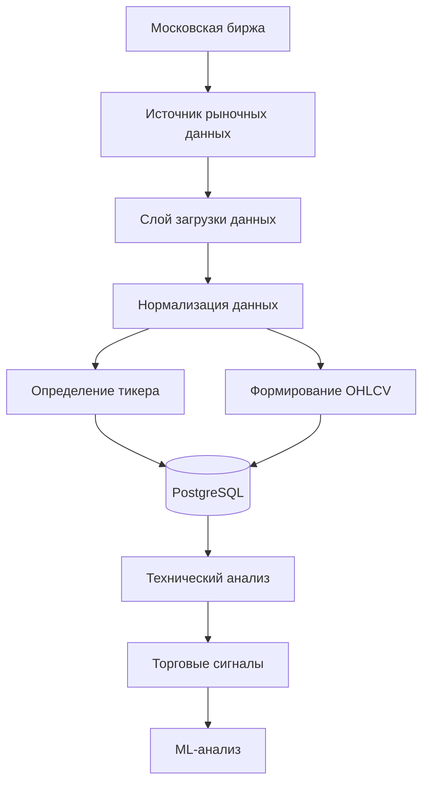
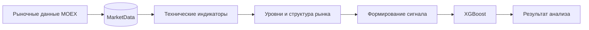
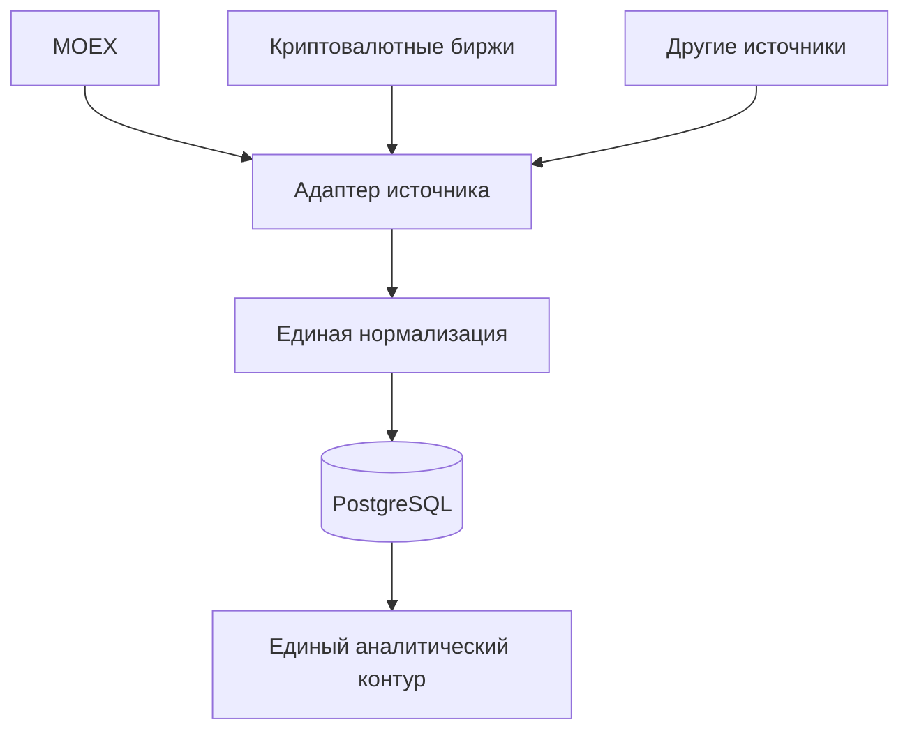

# Интеграция с MOEX

Проект поддерживает работу с рыночными данными российских ценных бумаг и содержит необходимые зависимости для взаимодействия с данными Московской биржи (MOEX).

Интеграция с MOEX является частью общего слоя загрузки рыночных данных. Полученные данные приводятся к единому формату и сохраняются в базе данных, после чего используются для технического анализа, формирования торговых сигналов и ML-моделей.

## Поддерживаемые компоненты

В проекте используются следующие зависимости:

- `moexalgo` — работа с данными Московской биржи;
- `yfinance` — получение рыночных данных через Yahoo Finance;
- `pandas` — обработка и нормализация данных;
- `numpy` — численные операции и обработка массивов.

Зависимости определены в:

```text
pyproject.toml
````

## Получение рыночных данных

MOEX является одним из источников рыночных данных для проекта.

Общий процесс обработки выглядит следующим образом:



## Нормализация данных

Проект использует единый формат рыночных данных независимо от источника.

После получения данных выполняется их подготовка:

1. получение исходных рыночных данных;
2. определение или создание тикера;
3. приведение названий и типов колонок к единому формату;
4. формирование OHLCV-записей;
5. сохранение данных в PostgreSQL.

Единая схема позволяет использовать данные разных источников в одном аналитическом контуре.

## OHLCV

Для анализа используются стандартные рыночные данные:

* **Open** — цена открытия;
* **High** — максимальная цена;
* **Low** — минимальная цена;
* **Close** — цена закрытия;
* **Volume** — объём торгов.

Эти данные являются основой для расчёта технических индикаторов, уровней, структуры цены и последующего формирования торговых сигналов.

## Хранение данных

После обработки данные сохраняются в модели:

```text
Ticker
MarketData
Exchange
```

Основная модель рыночных данных:

```text
swingtraderai/db/models/market.py
```

Логика сохранения находится в:

```text
swingtraderai/ingestion/saver.py
```

Таким образом, конкретный источник данных отвечает за получение информации, а модель хранения остаётся общей для различных рынков.

## Использование данных в анализе

После сохранения данные могут использоваться последующими уровнями системы:



Такой подход позволяет отделить получение данных от торгово-аналитической логики.

## Торговая концепция

Рыночные данные MOEX используются как исходная информация для анализа российского рынка.

При построении аналитики проект ориентируется на подходы технического анализа и концепции, связанные с торговлей по уровням, структурой движения цены, объёмом, ложными пробоями и подтверждением торгового сценария.

В частности, логика анализа развивается с учётом подходов, используемых в материалах Александра Герчика, а также идей из следующих источников:

* «Курс активного трейдера»;
* «Покупай, продавай, зарабатывай»;
* «Малая энциклопедия трейдера» — Эрик Л. Найман;
* **Mastering the Trade, 3rd Edition** — John F. Carter;
* **Swing and Day Trading: Evolution of a Trader** — Thomas N. Bulkowski.

При этом конкретная реализация алгоритмов определяется исходным кодом проекта, а не только используемой торговой литературой.

## Поддержка нескольких рынков

Архитектура ingestion-слоя не привязана исключительно к MOEX.

Проект рассчитан на работу с несколькими источниками рыночных данных, включая:

* российские ценные бумаги;
* криптовалютные рынки;
* другие источники, подключаемые через адаптеры ingestion-слоя.

Общая архитектура выглядит следующим образом:



Это позволяет добавлять новые источники без необходимости изменять основную модель хранения и последующие уровни анализа.

## Примечания

* `moexalgo` присутствует в зависимостях проекта и предназначен для работы с данными MOEX.
* `yfinance` также используется как источник рыночных данных.
* Рыночные данные проходят через общий ingestion-слой перед сохранением в базе данных.
* Формат хранения данных унифицирован для дальнейшего использования техническим анализом и ML.
* Точная реализация конкретного адаптера MOEX определяется кодом в `swingtraderai/ingestion/sources/`, поэтому описание интеграции должно основываться на фактической реализации адаптера, а не только на README или списке зависимостей.

## Ссылки на исходный код

* [Источники рыночных данных](https://github.com/BulatNS31/SwingTraderAI/tree/main/swingtraderai/ingestion/sources)
* [Сохранение рыночных данных](https://github.com/BulatNS31/SwingTraderAI/blob/main/swingtraderai/ingestion/saver.py)
* [Модели рыночных данных](https://github.com/BulatNS31/SwingTraderAI/blob/main/swingtraderai/db/models/market.py)
* [Зависимости проекта](https://github.com/BulatNS31/SwingTraderAI/blob/main/pyproject.toml)
