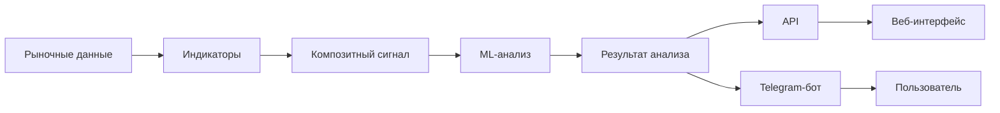
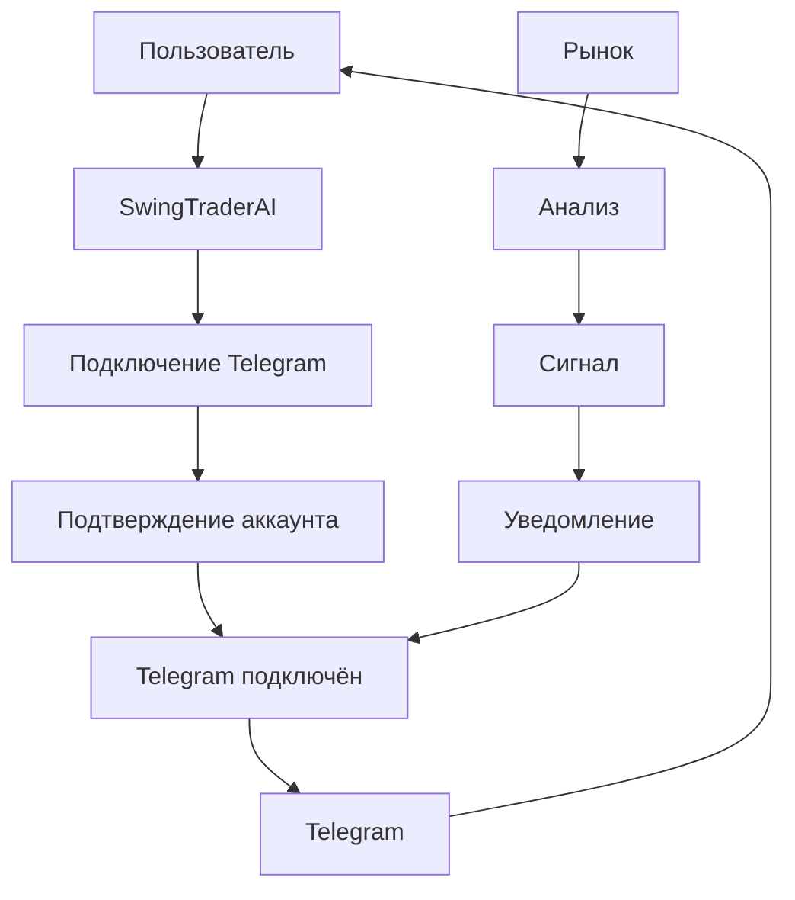

# Интеграция с Telegram

Проект предусматривает интеграцию с Telegram, которая позволяет пользователю подключить свой Telegram-аккаунт к системе и получать торговые сигналы и уведомления непосредственно через Telegram-бота.

Telegram выступает дополнительным каналом доставки результатов анализа. Основная логика формирования торговых сигналов остаётся внутри аналитической системы проекта.

## Основная концепция

Пользователь может связать свой аккаунт в SwingTraderAI с Telegram-ботом.

После подключения система получает возможность отправлять пользователю:

- торговые сигналы;
- уведомления об изменении сигнала;
- результаты анализа;
- важные события, связанные с отслеживаемыми инструментами;
- другие предусмотренные системой уведомления.

Общий принцип работы:

```mermaid
flowchart LR
    USER[Пользователь] --> ACCOUNT[Аккаунт SwingTraderAI]
    USER --> TG[Telegram-аккаунт]
    ACCOUNT --> LINK[Привязка Telegram]
    LINK --> BOT[Telegram-бот]

    MARKET[Рыночные данные] --> ANALYSIS[Аналитическая система]
    ANALYSIS --> SIGNAL[Торговый сигнал]
    SIGNAL --> BOT
    BOT --> TG
````

## Привязка Telegram-аккаунта

В модели пользователя предусмотрены поля, связанные с Telegram:

* `telegram_id` — идентификатор пользователя в Telegram;
* `telegram_verified` — статус подтверждения Telegram-аккаунта.

Эти данные позволяют связать пользователя SwingTraderAI с его аккаунтом в Telegram.

Логика привязки должна обеспечивать однозначное соответствие между аккаунтом пользователя в системе и его Telegram-аккаунтом.

## Получение торговых сигналов

После успешной привязки Telegram становится дополнительным каналом получения сигналов.

Основной поток выглядит следующим образом:

```mermaid
flowchart TD
    DATA[Рыночные данные] --> IND[Технический анализ]
    IND --> LEVELS[Уровни и структура рынка]
    LEVELS --> SIGNAL[Формирование сигнала]
    SIGNAL --> CHECK{Нужно отправить уведомление?}
    CHECK -->|Да| BOT[Telegram-бот]
    BOT --> MESSAGE[Сообщение пользователю]
    MESSAGE --> USER[Telegram]
    CHECK -->|Нет| WAIT[Ожидание следующего события]
```

Таким образом, Telegram не формирует торговое решение самостоятельно. Он используется как канал доставки уже сформированного системой результата анализа.

## Какие сигналы могут поступать

В зависимости от реализованной логики уведомлений пользователь может получать информацию о торговых сценариях, например:

* `BUY` — сигнал на покупку;
* `SELL` — сигнал на продажу;
* `STRONG_BUY` — сильный сигнал на покупку;
* `NEUTRAL` — отсутствие выраженного торгового преимущества;
* изменение силы или направления сигнала;
* появление нового торгового сценария по отслеживаемому инструменту.

Содержание уведомления может включать инструмент, направление сигнала, оценку силы и дополнительную аналитическую информацию.

## Связь с торговой аналитикой

Telegram является конечным каналом доставки, а не отдельным торговым движком.

Общая архитектура выглядит так:



Один и тот же результат анализа может использоваться несколькими интерфейсами: веб-приложением и Telegram.

## Безопасность

Привязка Telegram должна использовать механизм подтверждения аккаунта, чтобы предотвратить привязку чужого Telegram-аккаунта к пользовательскому профилю.

Поле `telegram_verified` предназначено для хранения статуса подтверждения привязки.

Telegram-идентификатор пользователя должен использоваться только для связи аккаунтов и доставки сообщений. Человечеству уже достаточно утечек идентификаторов, поэтому такие данные не следует помещать непосредственно в исходный код или публичную конфигурацию.

## Статус реализации

| Возможность                                | Статус                                    |
| ------------------------------------------ | ----------------------------------------- |
| Telegram ID пользователя                   | Реализовано на уровне модели пользователя |
| Статус подтверждения Telegram              | Реализован на уровне модели пользователя  |
| Концепция привязки Telegram-аккаунта       | Предусмотрена архитектурой                |
| Получение торговых сигналов через Telegram | Предусмотрено как интеграционный сценарий |
| Уведомления пользователя                   | Предусмотрены архитектурой                |
| Полный набор Telegram-функций              | Требует проверки конкретной реализации    |

## Концепция интеграции

Telegram-интеграция предназначена для того, чтобы пользователь не был обязан постоянно находиться в веб-интерфейсе SwingTraderAI.

После подключения аккаунта пользователь может получать важные торговые события непосредственно в Telegram:



Это делает Telegram дополнительным интерфейсом мониторинга рынка и получения торговых сигналов.

## Ссылки на исходный код

* [Модель пользователя](https://github.com/BulatNS31/SwingTraderAI/blob/main/swingtraderai/db/models/user.py)
* [Docker Compose](https://github.com/BulatNS31/SwingTraderAI/blob/main/docker-compose.yml)
* [Репозиторий проекта](https://github.com/BulatNS31/SwingTraderAI)
