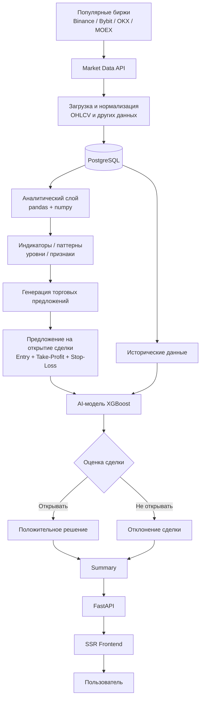

---

title: "Обзор"
description: "Обзор проекта и фактически реализованная архитектура репозитория"
-------------------------------------------------------------------------------

# Обзор SwingTraderAI

SwingTraderAI — приложение для анализа рынка акций и криптовалют. Репозиторий в основном представляет собой бэкенд на FastAPI с фронтендом на React, хранением данных в PostgreSQL, загрузкой рыночных данных, расчётом технических индикаторов и оценкой торговых сигналов с использованием моделей машинного обучения.

По своей сути кодовая база ближе к платформе для анализа торговли, чем к полноценному брокеру или движку исполнения ордеров. Приложение предоставляет данные по тикерам, индикаторы, списки наблюдения, записи портфеля и эндпоинты прогнозирования, однако текущая реализация сосредоточена именно на анализе, а не на исполнении реальных ордеров.

## Структура репозитория

* `swingtraderai/main.py`: точка входа FastAPI-приложения, middleware, CORS, ограничение частоты запросов.
* `swingtraderai/api/`: API-роутеры, сервисы и репозитории.
* `swingtraderai/db/`: модели SQLAlchemy и менеджер асинхронных сессий.
* `swingtraderai/indicators/`: реестр индикаторов и их расчёт с использованием pandas/pandas_ta.
* `swingtraderai/ml/`: обучение XGBoost и логика инференса.
* `swingtraderai/tasks/`: задачи Celery для загрузки рыночных данных.
* `frontend/src/`: приложение на Vite + React + TypeScript.
* `alembic/`: миграции базы данных.

## Что реализовано

| Возможность                                   | Статус                             | Подтверждение                                                                      |
| --------------------------------------------- | ---------------------------------- | ---------------------------------------------------------------------------------- |
| Бэкенд на FastAPI                             | Реализовано                        | `swingtraderai/main.py`                                                            |
| Асинхронные модели SQLAlchemy/PostgreSQL      | Реализовано                        | `swingtraderai/db/models/*.py`                                                     |
| Загрузка рыночных данных для MOEX/криптовалют | Реализовано                        | `swingtraderai/tasks/ingestion.py`, `swingtraderai/ingestion/`                     |
| Реестр технических индикаторов                | Реализовано                        | `swingtraderai/indicators/*.py`                                                    |
| Агрегация сигналов на основе индикаторов      | Реализовано                        | `swingtraderai/api/services/indicator_service.py`                                  |
| Обучение и инференс ML-моделей                | Реализовано                        | `swingtraderai/ml/trainer.py`, `swingtraderai/ml/inference.py`                     |
| Аутентификация пользователей и JWT            | Реализовано                        | `swingtraderai/api/v1/auth.py`, `swingtraderai/core/security.py`                   |
| SPA-фронтенд и поток аутентификации           | Реализовано                        | `frontend/src/app/router.tsx`                                                      |
| Стек Telegram-уведомлений                     | Частично / не полностью подключено | модель пользователя содержит `telegram_id`; активной реализации бота не обнаружено |
| Полноценное исполнение реальных сделок        | Не реализовано                     | модули брокера/исполнения не обнаружены                                            |

## Архитектура верхнего уровня

## Основная задача проекта

Этот репозиторий лучше всего рассматривать как исследовательскую платформу для генерации торговых сигналов:

* Загружает рыночные данные.
* Нормализует строки OHLCV и сохраняет их в базе данных.
* Рассчитывает технические индикаторы.
* Объединяет сигналы в составную оценку.
* Поддерживает пайплайн обучения XGBoost для признаков, связанных с ложными пробоями и уровнями.
* Предоставляет данные и прогнозы через REST API и интерфейс на React.

При этом в проекте пока не видно полноценного слоя управления ордерами, интеграции с брокером или автономного движка исполнения сделок.

## Ссылки на исходный код

* [Точка входа бэкенда](https://github.com/BulatNS31/SwingTraderAI/blob/main/swingtraderai/main.py)
* [Модели базы данных](https://github.com/BulatNS31/SwingTraderAI/tree/main/swingtraderai/db/models)
* [Индикаторы](https://github.com/BulatNS31/SwingTraderAI/tree/main/swingtraderai/indicators)
* [Обучение ML-модели](https://github.com/BulatNS31/SwingTraderAI/blob/main/swingtraderai/ml/trainer.py)
* [Роутер фронтенда](https://github.com/BulatNS31/SwingTraderAI/blob/main/frontend/src/app/router.tsx)
