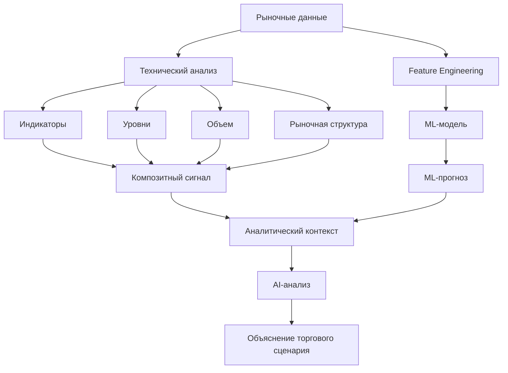
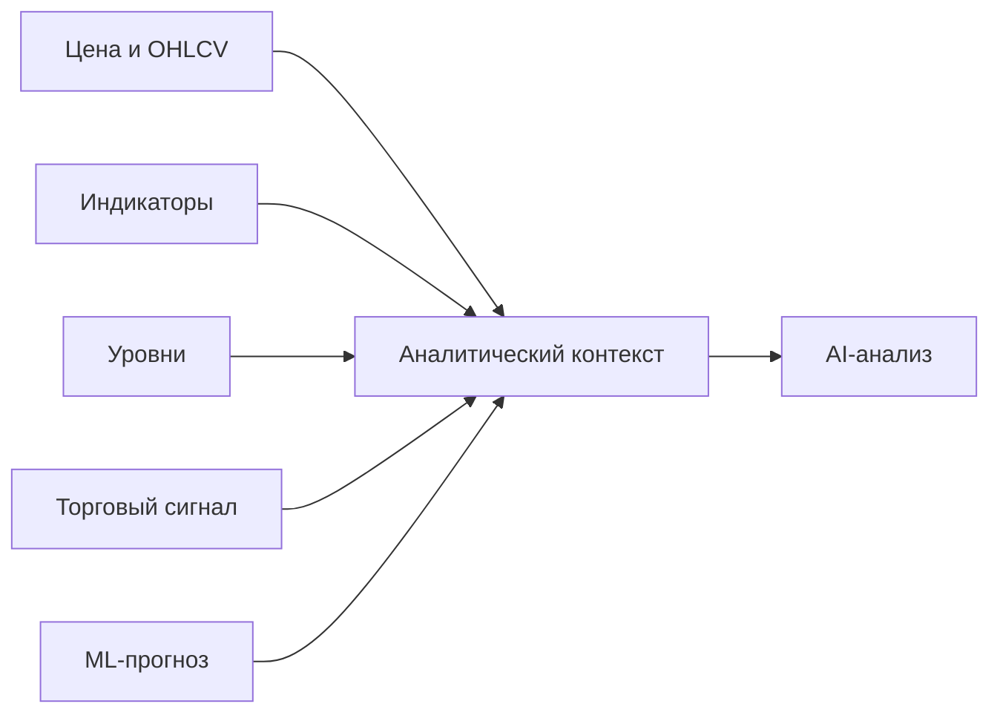
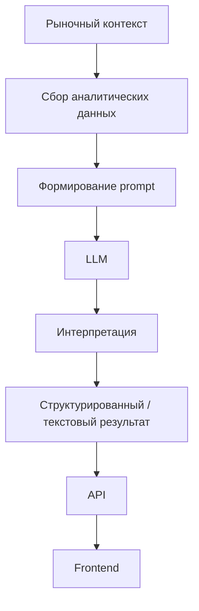
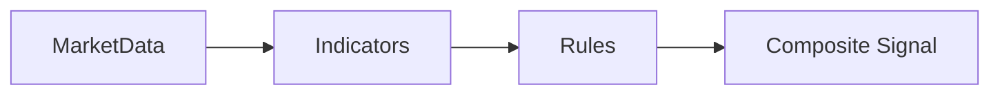
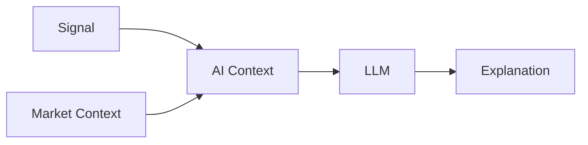
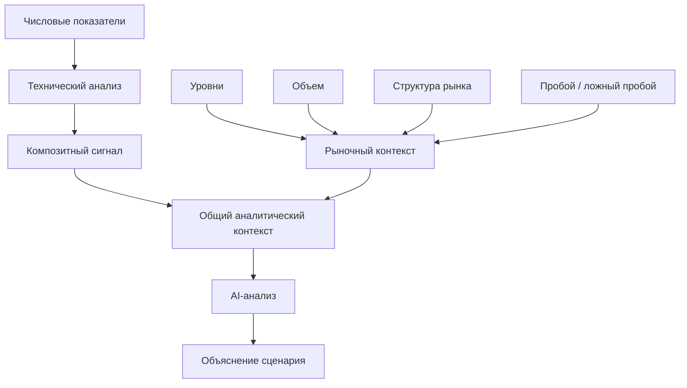
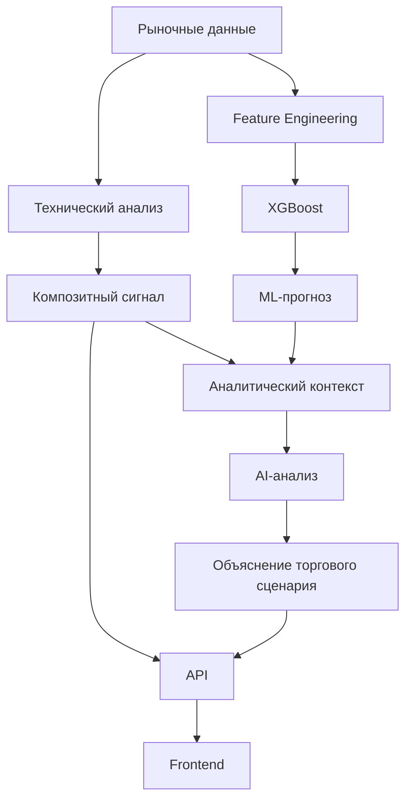

---

title: "AI-анализ"
description: "AI-ориентированный слой анализа и его связь с детерминированным сигнальным движком"
-------------------------------------------------------------------------------------------------

# AI-анализ

В **SwingTraderAI** предусмотрено направление развития AI-анализа, предназначенное для интерпретации рыночного контекста и результатов технического анализа.

AI-слой рассматривается как **дополнительный уровень аналитики и объяснения**, а не как основной механизм принятия торгового решения.

Основу системы составляют детерминированный технический анализ и ML-модели.

## Роль AI-анализа

Основная задача AI-слоя заключается не в том, чтобы самостоятельно решать, покупать или продавать актив, а в том, чтобы **интерпретировать уже полученные аналитические данные и представить их в понятном для трейдера виде**.

Общая концепция:



Таким образом, AI получает уже подготовленный контекст, а не заменяет фундаментальные компоненты системы.

## Входные данные

Предполагаемый AI-анализ использует рыночный контекст и результаты технического анализа.

В качестве входных данных могут выступать:

* исторические данные о цене;
* OHLCV;
* значения технических индикаторов;
* текущий торговый сигнал;
* сила сигнала;
* уровни поддержки и сопротивления;
* данные об объеме;
* признаки рыночной структуры;
* информация о пробоях и ложных пробоях;
* результаты ML-прогнозирования.

Упрощенно вход можно представить так:



## Методологический контекст

AI-слой должен интерпретировать результаты в рамках общей торговой концепции проекта.

Методологической основой SwingTraderAI являются подходы активного и свингового трейдинга, включая идеи из:

* **Александра Герчика**: «Курс активного трейдера», «Покупай, продавай, зарабатывай», «Малая энциклопедия трейдера»;
* **Эрика Л. Наймана**: «Малая энциклопедия трейдера»;
* **John F. Carter**: *Mastering the Trade*, 3rd Edition;
* **Thomas Bulkowski**: *Swing and Day Trading: Evolution of a Trader*.

AI-слой в этой концепции может использоваться для формирования понятного объяснения:

```text
Что происходит с ценой?
        ↓
Где находится цена относительно уровней?
        ↓
Что показывают индикаторы?
        ↓
Подтверждается ли движение объемом?
        ↓
Есть ли признаки пробоя или ложного пробоя?
        ↓
Что показывает ML-модель?
        ↓
Какой торговый сценарий формируется?
```

При этом AI не должен выдавать методологическую интерпретацию за гарантированный прогноз будущего движения цены.

## Обработка

Предполагаемый процесс работы AI-слоя:

1. собрать данные технического анализа;
2. добавить текущий торговый сигнал;
3. добавить дополнительные характеристики рыночного контекста;
4. при необходимости добавить ML-прогноз;
5. сформировать структурированный prompt;
6. передать контекст в LLM;
7. получить текстовое или структурированное объяснение;
8. передать результат пользователю через API или интерфейс.

Общая схема:



## LangChain и LangGraph

В зависимостях проекта присутствуют:

```text
langchain
langgraph
```

Они указывают на предусмотренную архитектуру для построения AI/LLM-компонентов и последовательностей обработки.

В концепции проекта эти инструменты могут использоваться для организации:

* формирования контекста;
* последовательности аналитических шагов;
* взаимодействия между отдельными AI-компонентами;
* генерации объяснений;
* структурированной обработки результатов.

Однако наличие зависимостей само по себе не подтверждает наличие полностью реализованного production-ready AI pipeline.

## AI не заменяет сигнальный движок

Архитектурно важно разделять два уровня:

### Детерминированный анализ

Отвечает на вопрос:

> **Что показывают рассчитанные правила и показатели?**



### AI-анализ

Отвечает на вопрос:

> **Как понятным языком интерпретировать полученный аналитический контекст?**



Это принципиальное разделение.

AI не должен превращать систему из аналитического инструмента в непрозрачный «черный ящик», которому предлагается доверить деньги только потому, что он умеет красиво формулировать предложения. Люди уже достаточно раз доказали, что уверенный тон принимают за компетентность.

## Ожидаемый результат

Результатом AI-анализа может быть:

* текстовое объяснение текущей рыночной ситуации;
* описание факторов, повлиявших на сигнал;
* интерпретация технических показателей;
* описание потенциального торгового сценария;
* структурированное резюме;
* объяснение сильных и слабых сторон текущего сигнала.

Например, концептуально:

```text
Рыночный контекст
        ↓
Сигнал: BUY
        ↓
Поддерживающие факторы:
- цена находится выше уровня поддержки
- присутствует положительный импульс
- технические индикаторы подтверждают движение
- объем поддерживает сценарий

Сдерживающие факторы:
- близость сопротивления
- недостаточная сила пробоя

ML-прогноз:
положительное направление

AI-интерпретация:
текущий сценарий имеет признаки продолжения движения,
но требует подтверждения поведения цены около сопротивления.
```

Это именно **объяснение аналитического результата**, а не автоматическая торговая команда.

## AI и торговый сценарий

В рамках концепции SwingTraderAI AI-анализ может использоваться для перехода от набора числовых показателей к более понятному торговому сценарию:



Таким образом, AI-слой является последующим уровнем обработки, который делает аналитические результаты более интерпретируемыми.

## Ограничение текущей реализации

На текущем этапе документация должна четко разделять **архитектурное намерение** и **подтвержденную runtime-реализацию**.

В репозитории присутствуют:

* AI/LLM-зависимости;
* `LangChain`;
* `LangGraph`;
* ML-модуль;
* технический анализ;
* сигнальный движок.

Однако наличие этих компонентов не означает, что полноценный production-ready AI pipeline уже полностью подключен и используется во всех активных runtime-сценариях.

Поэтому корректная формулировка:

> **AI-анализ является предусмотренным аналитическим слоем SwingTraderAI, предназначенным для интерпретации рыночного контекста и результатов технического и ML-анализа. Полная runtime-реализация AI pipeline требует отдельной проверки активных путей выполнения.**

## Текущий статус

| Компонент                         | Статус                           |
| --------------------------------- | -------------------------------- |
| Технический анализ                | Реализовано                      |
| Детерминированные сигналы         | Реализовано                      |
| ML-анализ                         | Реализовано                      |
| LangChain в зависимостях          | Присутствует                     |
| LangGraph в зависимостях          | Присутствует                     |
| Архитектура AI-анализа            | Предусмотрена                    |
| Полный AI runtime pipeline        | Требует дополнительной валидации |
| AI как автономный торговый движок | Не реализован                    |
| Автоматическое исполнение сделок  | Не реализовано                   |

## Архитектурная роль

Итоговая роль AI-слоя в SwingTraderAI:



**AI в SwingTraderAI не является заменой техническому анализу или ML.**

Его предполагаемая роль заключается в том, чтобы объединять результаты различных аналитических компонентов в понятное человеку объяснение текущего рыночного сценария.

## Исходный код

* [Зависимости проекта](https://github.com/BulatNS31/SwingTraderAI/blob/main/pyproject.toml)
* [ML-модуль](https://github.com/BulatNS31/SwingTraderAI/tree/main/swingtraderai/ml)
* [Сервис индикаторов](https://github.com/BulatNS31/SwingTraderAI/blob/main/swingtraderai/api/services/indicator_service.py)
