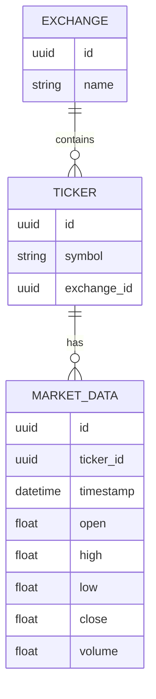
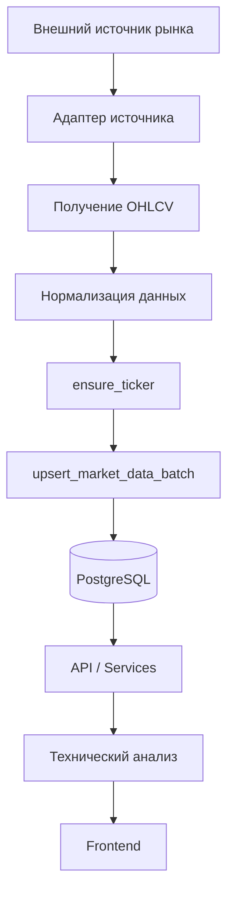
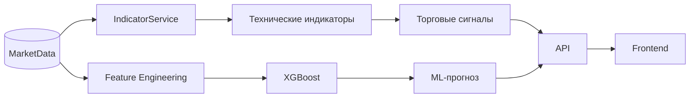
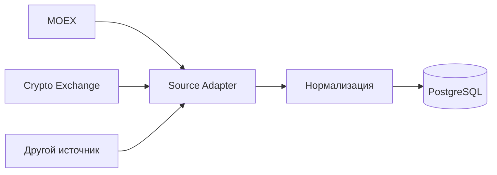

---

title: "Рыночные данные"
description: "Фактически реализованный слой получения, обработки и хранения рыночных данных"
--------------------------------------------------------------------------------------------

# Рыночные данные

В **SwingTraderAI** основной pipeline работы с рыночными данными реализован на уровне **ingestion-слоя** и **слоя базы данных**.

Система получает исходные данные о рынке, приводит их к единому формату, сохраняет в PostgreSQL и использует эти данные для последующего технического анализа, формирования торговых сигналов и ML-прогнозирования.

## Поддерживаемые источники и рынки

В репозитории присутствует логика получения данных для нескольких типов рынков, включая:

* данные, связанные с **Московской биржей (MOEX)**;
* данные криптовалютных бирж через адаптеры в `swingtraderai/ingestion/sources/`;
* единый формат хранения свечных данных **OHLCV**.

Для работы с рыночными данными используются соответствующие зависимости и источники, включая:

* `moexalgo`;
* `yfinance`;
* `ccxt`.

Конкретный источник отделен от основной логики обработки с помощью адаптеров.

## Формат рыночных данных

Основным форматом свечных данных является **OHLCV**:

| Поле     | Значение          |
| -------- | ----------------- |
| `Open`   | Цена открытия     |
| `High`   | Максимальная цена |
| `Low`    | Минимальная цена  |
| `Close`  | Цена закрытия     |
| `Volume` | Объем             |

Эти данные являются фундаментом для последующего анализа.

На их основе система рассчитывает технические индикаторы, определяет характеристики ценового движения и формирует признаки для ML-модели.

## Модель хранения

Постоянное хранение рыночных данных реализовано через SQLAlchemy-модели:

* `Ticker` — информация о торговом инструменте;
* `MarketData` — исторические рыночные данные;
* `Exchange` — информация о торговой площадке или источнике.

Модели находятся в:

```text
swingtraderai/db/models/market.py
```

Упрощенная структура:



## Pipeline загрузки данных

Фактический поток данных состоит из нескольких последовательных этапов:



### 1. Получение данных

Адаптер источника обращается к внешнему API или другому поставщику рыночных данных.

Основная задача ingestion находится в:

```text
swingtraderai/tasks/ingestion.py
```

### 2. Нормализация

Полученные данные приводятся к единому внутреннему формату.

Это позволяет использовать одинаковую структуру данных независимо от того, откуда была получена свеча.

### 3. Определение тикера

Перед сохранением система использует:

```text
ensure_ticker()
```

для поиска или создания соответствующей записи `Ticker`.

### 4. Сохранение свечей

Стандартизированные данные сохраняются через:

```text
upsert_market_data_batch()
```

Реализация находится в:

```text
swingtraderai/ingestion/saver.py
```

Использование upsert позволяет обновлять существующие записи и предотвращать ненужное дублирование данных.

## Использование данных в аналитике

После сохранения рыночные данные становятся источником для последующих аналитических процессов.

Общий поток:



Таким образом, база данных выступает не просто архивом свечей, а центральным источником данных для аналитического pipeline.

## Рыночные данные и торговая методология

В концепции SwingTraderAI рыночные данные используются не только для расчета стандартных индикаторов.

Они являются основой для анализа:

* ценовой структуры;
* уровней поддержки и сопротивления;
* пробоев;
* ложных пробоев;
* объема;
* направления движения;
* торговых сценариев;
* признаков для ML-модели.

Такой подход соответствует общей концепции проекта, ориентированной на методы активного и свингового трейдинга.

Поэтому система стремится анализировать **контекст движения цены**, а не сводить решение к одному техническому индикатору.

## Разделение источника и хранения

Архитектура отделяет внешний источник данных от внутреннего хранилища:



Это позволяет добавлять новые источники без необходимости переписывать основную логику работы с `MarketData`.

## Состояние реализации

| Компонент                            | Статус         |
| ------------------------------------ | -------------- |
| Получение рыночных данных            | Реализовано    |
| Адаптеры источников                  | Реализовано    |
| Нормализация OHLCV                   | Реализовано    |
| Модель `Ticker`                      | Реализовано    |
| Модель `MarketData`                  | Реализовано    |
| Модель `Exchange`                    | Реализовано    |
| Сохранение в PostgreSQL              | Реализовано    |
| Использование данных для индикаторов | Реализовано    |
| Использование данных для ML          | Реализовано    |
| Автоматическое исполнение сделок     | Не реализовано |

## Важное ограничение

Слой рыночных данных отвечает за **получение, нормализацию и хранение информации о рынке**.

Он не является брокерским или торговым execution-слоем.

Текущий pipeline заканчивается на предоставлении подготовленных данных аналитическим компонентам:

```text
Источник
   ↓
Ingestion
   ↓
Нормализация
   ↓
PostgreSQL
   ↓
Технический анализ / ML
   ↓
Торговый сигнал
```

Автоматическая отправка ордеров брокеру в рамках текущего репозитория не реализована.

## Исходный код

* [Задача загрузки данных](https://github.com/BulatNS31/SwingTraderAI/blob/main/swingtraderai/tasks/ingestion.py)
* [Сохранение рыночных данных](https://github.com/BulatNS31/SwingTraderAI/blob/main/swingtraderai/ingestion/saver.py)
* [Модели рыночных данных](https://github.com/BulatNS31/SwingTraderAI/blob/main/swingtraderai/db/models/market.py)
* [Источники рыночных данных](https://github.com/BulatNS31/SwingTraderAI/tree/main/swingtraderai/ingestion/sources)
