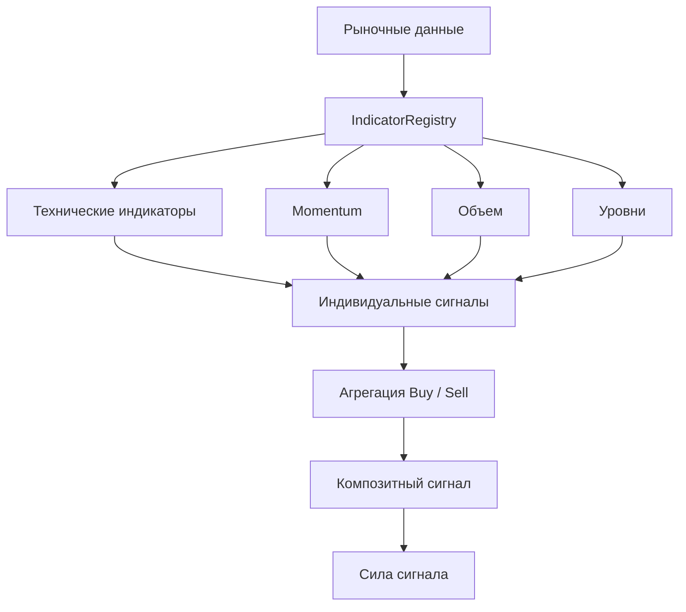
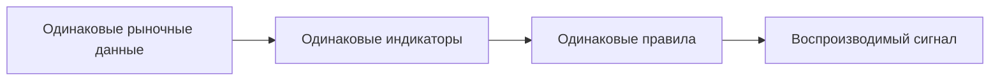
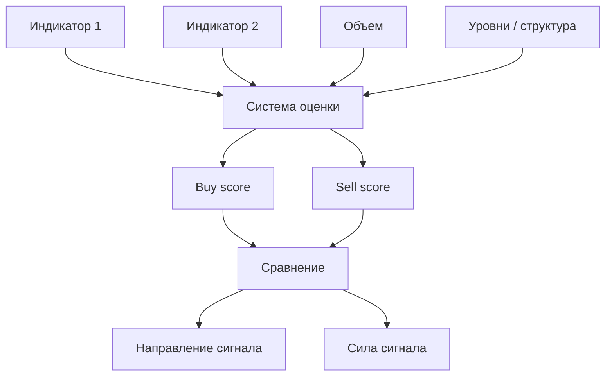
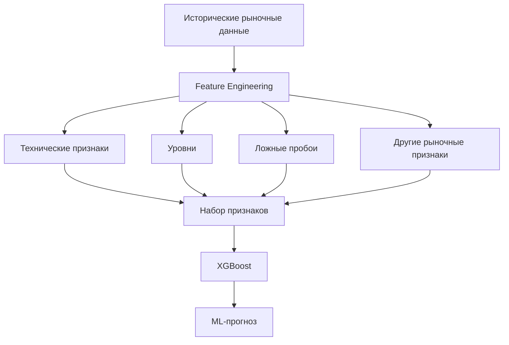
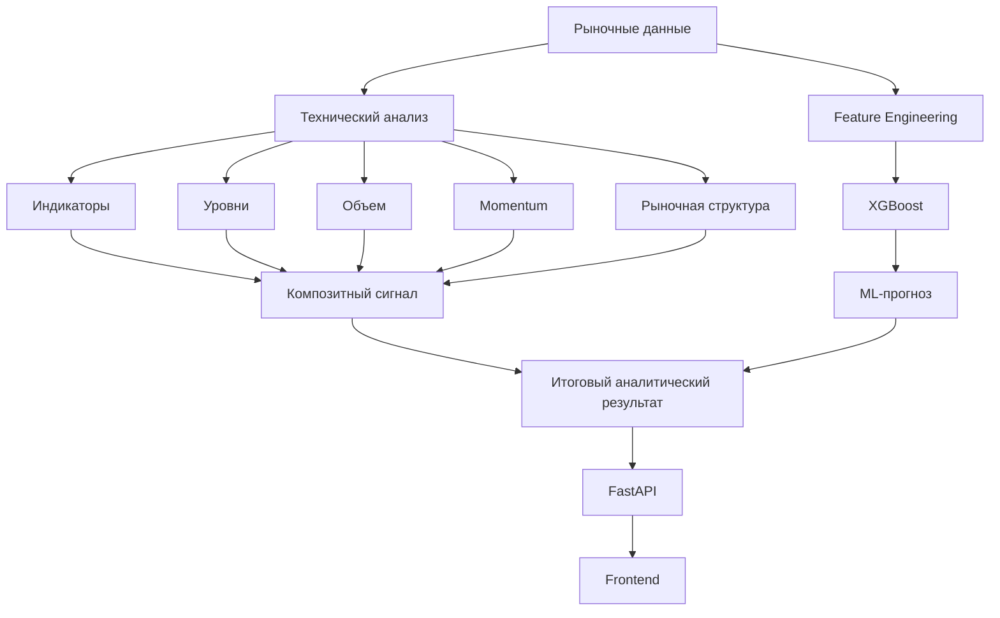
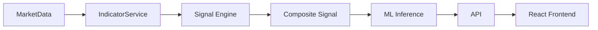
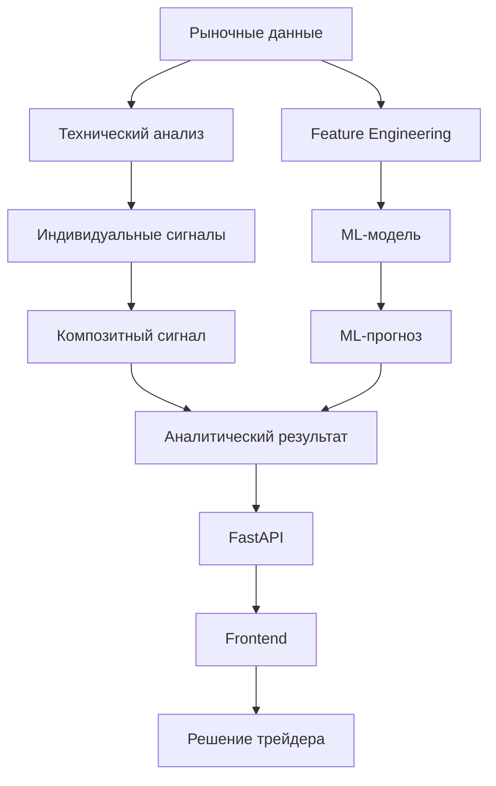

---

# Торговые сигналы

**SwingTraderAI** формирует торговые сигналы на основе рыночных данных, технических индикаторов и совокупной оценки текущего рыночного контекста.

В зависимости от сценария к результату технического анализа может дополнительно применяться **ML-модель**, которая выполняет классификацию направления движения на основе подготовленных рыночных признаков.

Главная идея системы заключается не в том, чтобы принимать решение по одному индикатору, а в том, чтобы **собрать несколько независимых факторов в единый аналитический сигнал**.

## Концепция формирования сигнала

Основной pipeline выглядит следующим образом:

```text
Рыночные данные
      ↓
Расчет индикаторов
      ↓
Анализ уровней, объема и импульса
      ↓
Агрегация сигналов
      ↓
Композитный торговый сигнал
      ↓
Опциональный ML-прогноз
      ↓
API
      ↓
Frontend
```

Важной частью концепции является разделение **сигнала** и **исполнения сделки**.

Система формирует аналитический результат, но не отправляет торговый приказ брокеру автоматически.

## Методологическая основа

Логика формирования сигналов разрабатывается с учетом принципов активного и свингового трейдинга, включая идеи из следующих источников:

\* **Александр Герчик**: «Курс активного трейдера», «Покупай, продавай, зарабатывай», «Малая энциклопедия трейдера»; \* **Эрик Л. Найман**: «Малая энциклопедия трейдера»; \* **John F. Carter**: _Mastering the Trade_, 3rd Edition; \* **Thomas Bulkowski**: _Swing and Day Trading: Evolution of a Trader_.

В частности, в аналитическом подходе учитываются:

\* уровни поддержки и сопротивления; \* ценовая структура; \* пробои и ложные пробои; \* объем; \* импульс движения; \* технические индикаторы; \* подтверждение торгового сценария несколькими факторами.

Эти книги являются **методологической основой проекта**, но не означают буквальную реализацию каждой описанной в них стратегии.

## Формирование композитного сигнала

Основная логика находится в:

```text
swingtraderai/api/services/indicator_service.py
```

Метод:

```text
IndicatorService.get_signals()
```

обрабатывает зарегистрированные индикаторы и агрегирует полученные значения в общий результат.

Упрощенная схема:



Каждый компонент предоставляет собственный аналитический вклад, после чего система получает итоговую оценку.

## Детерминированный сигнальный слой

Базовый сигнальный движок является **детерминированным и основанным на правилах**.

Это означает, что результат зависит от:

\* входных рыночных данных; \* выбранного тикера; \* таймфрейма; \* рассчитанных индикаторов; \* правил агрегации.

При одинаковых входных условиях система должна получать одинаковый результат.

Это принципиально отличает данный слой от генеративного AI.



Такой подход делает базовую часть системы прозрачной и пригодной для тестирования.

## Типы сигналов

В текущей реализации используются состояния, связанные с направлением и силой сигнала, включая:

\* `BUY` — сигнал в пользу покупки; \* `SELL` — сигнал в пользу продажи; \* `STRONG_BUY` — усиленный сигнал в пользу покупки; \* `NEUTRAL` — отсутствие выраженного преимущества одной стороны.

Важно понимать, что название сигнала не является гарантией будущего движения цены.

Сигнал представляет собой **результат алгоритмической оценки текущих условий рынка**, а не обещание результата сделки. Рынок, как обычно, не подписывал договор о сотрудничестве с нашей документацией.

## Сила сигнала

Помимо направления, система использует количественную оценку совокупности сигналов.

Упрощенно:



Таким образом, итоговый сигнал формируется не на основании одного показателя, а посредством агрегации нескольких аналитических факторов.

## ML-слой

После формирования детерминированного сигнала может использоваться отдельный ML-слой.

Основная реализация находится в:

```text
swingtraderai/ml/inference.py
```

Модель использует подготовленные рыночные признаки и выполняет классификацию.

Общий pipeline:



ML-модель является **дополнительным аналитическим слоем**, а не заменой детерминированного технического анализа.

## Совместная модель сигнала и ML

Общую архитектуру можно представить следующим образом:



Такое разделение позволяет различать:

1. **что показывают правила и технические индикаторы**; 2. **что прогнозирует ML-модель**; 3. **какой аналитический результат получает пользователь**.

## Рыночный контекст важнее одного индикатора

SwingTraderAI ориентирован на контекстный анализ.

Например, сам факт пересечения двух скользящих средних еще не является достаточным основанием для формирования качественного торгового сценария.

Система стремится учитывать одновременно:

```text
Цена
 ↓
Уровень
 ↓
Положение цены относительно уровня
 ↓
Объем
 ↓
Импульс
 ↓
Структура движения
 ↓
Пробой / ложный пробой
 ↓
Технические индикаторы
 ↓
Композитный сигнал
```

Это особенно важно для свингового и активного трейдинга, где качество торгового сценария определяется совокупностью условий.

## API и использование сигнала

После формирования результат передается через backend API и используется frontend-приложением.

Упрощенная схема:



Frontend может использовать результат для отображения:

\* направления сигнала; \* аналитических показателей; \* информации по тикеру; \* рыночного контекста; \* результатов ML-прогнозирования.

## Что сигнал означает на практике

Сигнал следует рассматривать как **инструмент поддержки принятия торгового решения**, а не как автоматическую команду:

```text
BUY
```

не означает:

```text
"обязательно купить прямо сейчас"
```

Аналогично:

```text
SELL
```

не означает:

```text
"цена гарантированно упадет"
```

Корректная интерпретация:

```text
Рыночные данные
      ↓
Алгоритмическая оценка
      ↓
Торговый сценарий
      ↓
Сигнал
      ↓
Анализ и решение трейдера
```

## Статус реализации

| Компонент | Статус |
| --- | --- |
| Получение рыночных данных | Реализовано |
| Расчет технических индикаторов | Реализовано |
| Анализ уровней | Реализовано |
| Анализ объема | Реализовано |
| Momentum-анализ | Реализовано |
| Детерминированная агрегация сигналов | Реализовано |
| Композитный торговый сигнал | Реализовано |
| ML-классификация | Реализовано |
| Автоматическое принятие торгового решения | Не реализовано |
| Брокерская интеграция | Не реализовано |
| Автоматическая отправка ордеров | Не реализовано |

## Архитектурная роль

Сигнальный слой занимает промежуточное положение между техническим анализом и пользовательским интерфейсом:



Таким образом, **торговый сигнал в SwingTraderAI является результатом алгоритмического анализа рынка и инструментом поддержки принятия решений**.

Он объединяет детерминированную оценку технических факторов с дополнительным ML-прогнозом, но не является самостоятельной системой автоматической торговли.

## Исходный код

\* [Сервис индикаторов и сигналов](https://github.com/BulatNS31/SwingTraderAI/blob/main/swingtraderai/api/services/indicator_service.py) \* [ML inference](https://github.com/BulatNS31/SwingTraderAI/blob/main/swingtraderai/ml/inference.py) \* [API тикеров](https://github.com/BulatNS31/SwingTraderAI/blob/main/swingtraderai/api/v1/tickers.py)