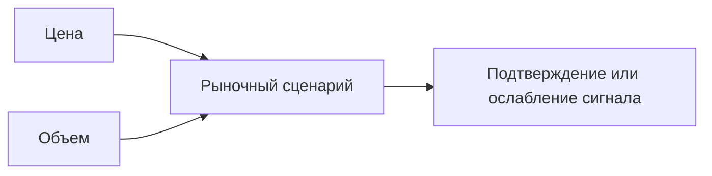
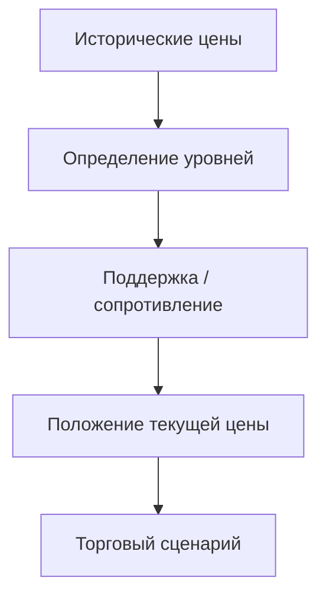
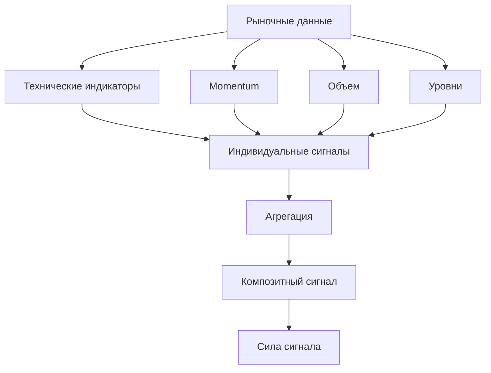
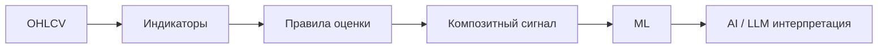
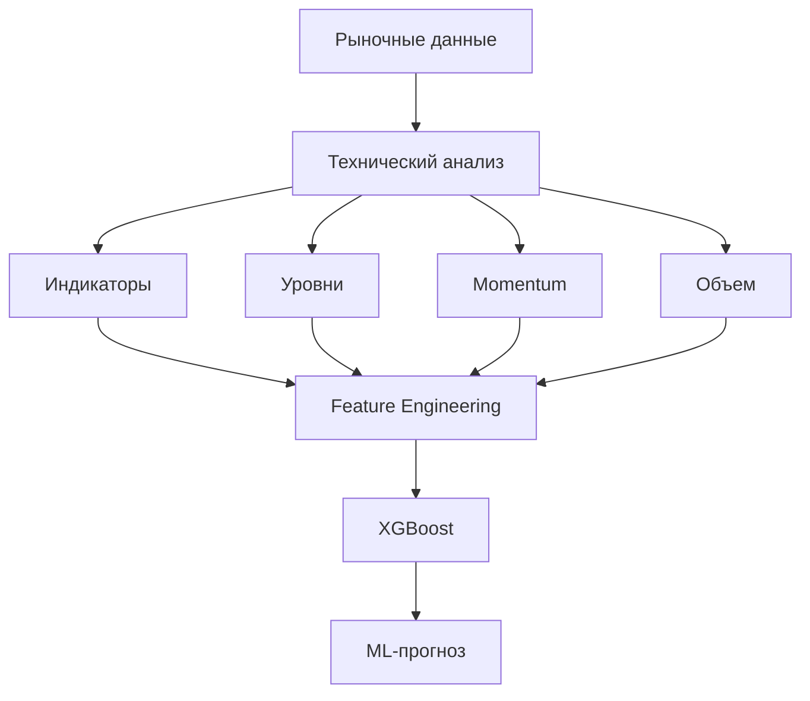
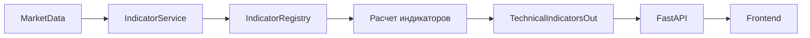
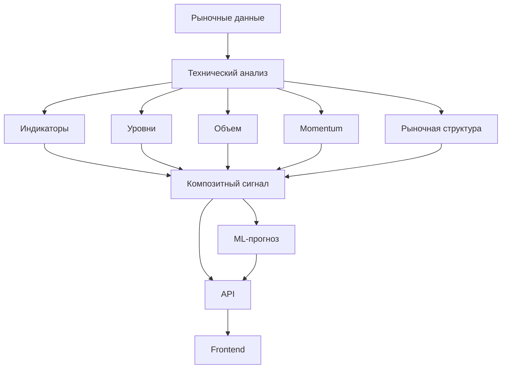

---

title: "Технический анализ"
description: "Слой технического анализа, который используется для формирования торговых сигналов в SwingTraderAI"
-----------------------------------------------------------------------------------------------------------------

# Технический анализ

В **SwingTraderAI** реализован отдельный слой технического анализа в директории:

```text
swingtraderai/indicators/
```

Этот слой отвечает за расчет технических показателей, анализ отдельных характеристик рынка и формирование исходных сигналов, которые затем агрегируются в единый торговый сигнал.

Технический анализ является одним из ключевых элементов системы и служит связующим звеном между **рыночными данными** и **торговым сценарием**.

## Концепция технического анализа

SwingTraderAI не строится вокруг одного индикатора или простой схемы вида «индикатор показал BUY → покупаем».

Вместо этого используется совокупность факторов:

* движение цены;
* тренд и импульс;
* объем;
* уровни поддержки и сопротивления;
* ценовая структура;
* пробои и ложные пробои;
* технические индикаторы;
* совокупность полученных сигналов.

Это соответствует общей концепции проекта, ориентированной на подходы активного и свингового трейдинга.

В основе методологии используются идеи из работ:

* **Александра Герчика**: «Курс активного трейдера», «Покупай, продавай, зарабатывай», «Малая энциклопедия трейдера»;
* **Эрика Л. Наймана**: «Малая энциклопедия трейдера»;
* **John F. Carter**: *Mastering the Trade*, 3rd Edition;
* **Thomas Bulkowski**: *Swing and Day Trading: Evolution of a Trader*.

При этом данные источники являются **методологической основой проекта**, а не утверждением о том, что каждая описанная в книгах стратегия буквально перенесена в код.

## Структура слоя индикаторов

Основная реализация находится в:

```text
swingtraderai/indicators/
```

Ключевые модули:

```text
swingtraderai/indicators/
├── registry.py
├── technical.py
├── momentum.py
├── volume.py
└── levels.py
```

Каждый модуль отвечает за определенный класс аналитических признаков.

## Реестр индикаторов

Центральным компонентом является:

```text
swingtraderai/indicators/registry.py
```

`IndicatorRegistry` предоставляет единый механизм регистрации и получения доступных индикаторов.

Архитектурно это позволяет отделить:

```text
Определение индикатора
        ↓
Регистрация
        ↓
Получение через Registry
        ↓
Расчет
        ↓
Использование в Signal Engine
```

Такой подход упрощает расширение системы: новый индикатор может быть добавлен в аналитический слой без необходимости переписывать всю цепочку формирования сигналов.

## Технические индикаторы

Модуль:

```text
swingtraderai/indicators/technical.py
```

содержит технические расчеты, используемые для оценки текущего состояния рынка.

Они могут использоваться для определения:

* направления движения;
* состояния тренда;
* относительной силы движения;
* потенциальных зон изменения поведения цены.

Для вычислений также используется библиотека `pandas_ta`.

## Momentum-анализ

Модуль:

```text
swingtraderai/indicators/momentum.py
```

содержит показатели и эвристики, связанные с импульсом движения цены.

Momentum-признаки помогают оценивать:

* силу текущего движения;
* ускорение или ослабление движения;
* направление краткосрочного импульса;
* потенциальное изменение текущего сценария.

В контексте свингового анализа это особенно важно, поскольку сама по себе цена не всегда показывает, насколько устойчиво текущее движение.

## Анализ объема

Модуль:

```text
swingtraderai/indicators/volume.py
```

отвечает за признаки, связанные с объемом.

Объем рассматривается как дополнительное подтверждение ценового движения.

Упрощенная логика:



Это соответствует общему подходу проекта: изменение цены должно рассматриваться в контексте активности рынка, а не изолированно.

## Уровни

Модуль:

```text
swingtraderai/indicators/levels.py
```

предназначен для работы с уровнями и связанными с ними признаками.

Уровни являются важной частью концепции SwingTraderAI, поскольку позволяют оценивать положение текущей цены относительно значимых зон рынка.

Упрощенно:



В дальнейшем информация об уровнях также может использоваться при формировании признаков для ML-модели.

## Формирование торгового сигнала

После расчета отдельных показателей они передаются в сервис формирования сигналов.

Основной метод:

```text
IndicatorService.get_signals()
```

находится в:

```text
swingtraderai/api/services/indicator_service.py
```

Он получает значения сигналов от зарегистрированных индикаторов и агрегирует их.

Общая схема:



## Типы сигналов

В результате агрегации система может формировать такие значения, как:

* `BUY`;
* `SELL`;
* `STRONG_BUY`;
* `NEUTRAL`.

Таким образом, отдельные индикаторы не являются конечным результатом анализа.

Они формируют **компоненты общего сигнала**.

## Детерминированная модель

Текущий сигнальный слой является **детерминированным и основанным на правилах**.

При одинаковых:

* рыночных данных;
* таймфрейме;
* настройках;
* наборе индикаторов;

система должна получать воспроизводимый результат.

Это принципиально отличается от LLM-слоя, который предназначен для интерпретации и объяснения результатов.

Общая архитектура:



## Технический анализ и рыночный контекст

В SwingTraderAI технический анализ не должен рассматриваться как набор независимых индикаторов.

Цель слоя заключается в формировании **структурированного представления текущего рыночного контекста**.

Например:

```text
Цена
 ↓
Структура рынка
 ↓
Уровни
 ↓
Объем
 ↓
Импульс
 ↓
Технические индикаторы
 ↓
Совокупность признаков
 ↓
Торговый сценарий
 ↓
Композитный сигнал
```

Такой подход ближе к задаче анализа торговой ситуации, чем к механическому поиску одного «идеального» индикатора. Человечество, к счастью, пока не обнаружило такой индикатор.

## Связь с ML

Результаты технического анализа также могут использоваться при подготовке признаков для ML-модели.

Общий pipeline:



Таким образом, технический анализ и ML являются связанными, но отдельными слоями.

**Технический анализ** формирует измеримые признаки и детерминированные сигналы.

**ML-модель** использует подготовленные признаки для статистического прогнозирования.

## API-контракт

Результаты расчета индикаторов доступны через API.

Основная точка взаимодействия находится в:

```text
swingtraderai/api/services/indicator_service.py
```

Метод:

```text
IndicatorService.get_indicators()
```

рассчитывает необходимые показатели для выбранного тикера и таймфрейма.

Таким образом, поток выглядит следующим образом:



## Состояние реализации

| Компонент                               | Статус         |
| --------------------------------------- | -------------- |
| Реестр индикаторов                      | Реализовано    |
| Технические индикаторы                  | Реализовано    |
| Momentum-анализ                         | Реализовано    |
| Анализ объема                           | Реализовано    |
| Анализ уровней                          | Реализовано    |
| Агрегация сигналов                      | Реализовано    |
| Композитный сигнал                      | Реализовано    |
| Feature Engineering для ML              | Реализовано    |
| Полностью автономная торговая стратегия | Не реализовано |
| Автоматическое исполнение сделок        | Не реализовано |

## Архитектурная роль

Технический анализ является центральным аналитическим слоем между рыночными данными и последующими этапами системы:



В результате технический анализ в SwingTraderAI является не конечной торговой системой, а **фундаментом для формирования торгового сценария, композитного сигнала и дальнейшего ML-анализа**.

## Исходный код

* [Реестр индикаторов](https://github.com/BulatNS31/SwingTraderAI/blob/main/swingtraderai/indicators/registry.py)
* [Сервис индикаторов](https://github.com/BulatNS31/SwingTraderAI/blob/main/swingtraderai/api/services/indicator_service.py)
* [Модуль технических индикаторов](https://github.com/BulatNS31/SwingTraderAI/blob/main/swingtraderai/indicators/technical.py)
* [Модуль Momentum](https://github.com/BulatNS31/SwingTraderAI/blob/main/swingtraderai/indicators/momentum.py)
* [Модуль объема](https://github.com/BulatNS31/SwingTraderAI/blob/main/swingtraderai/indicators/volume.py)
* [Модуль уровней](https://github.com/BulatNS31/SwingTraderAI/blob/main/swingtraderai/indicators/levels.py)
* [Все модули технического анализа](https://github.com/BulatNS31/SwingTraderAI/tree/main/swingtraderai/indicators)
